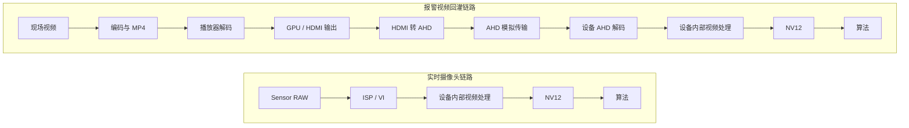
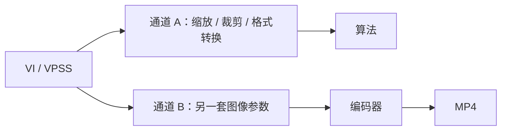
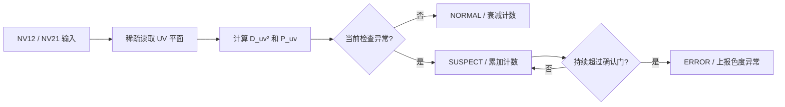

# IR camera input-chain reproduction and chroma anomaly diagnostics

## Evidence boundary

本条目由一次 IR 摄像头、报警视频回灌和 NV12 输入异常排查对话抽象而来。当前没有导入原始 NV12、相机规格书、ISP/AHD 寄存器、连续日志、视频注入盒子实测数据或多设备统计，因此下文保存的是**候选问题结构、区分实验和运行时诊断合同**，不是已验证的相机结论或生产阈值。

内容只保留可迁移的视频链路知识，不记录客户、供应商、设备型号、内部库实现或可反推具体项目的参数。公开或晋级前必须完成独立实验和 IP 审查。

## Problem

实时摄像头输入与报警视频回灌经过不同的视频链路，即使最终都以 NV12 送入算法，实际像素、几何、帧序列和系统时序也可能不同。若直接把“回灌不能复现”归因于模型，会把编码、颜色解释、视频制式、AHD 解码或业务时序问题误判为感知问题。

典型链路如下：



现场通常不能持续保存原始 NV12：未压缩数据占用空间大，帧复制、缓存同步和落盘还可能改变算法帧率、线程调度和原问题现场。因此诊断方案不能依赖“长期保存全部原始帧”。

## Goal and non-goal

### Goal

- 找到两条链路的**首个显著分歧边界**；
- 区分感知、判决和系统三类问题；
- 在不持续保存 NV12 的条件下保留足够证据；
- 标定播放器、HDMI、注入盒子和 AHD 接收链路；
- 建立 IR 灰度/色度异常的低成本运行时检测；
- 将可控偏差固定，将不可逆偏差纳入容差和回滚条件。

### Non-goal

- 不承诺实时链路和回灌链路逐像素一致；
- 不从单张截图直接证明 IR-cut、ISP 或 UV/VU 是根因；
- 不用视觉上“更清楚”替代下游检测和报警 Oracle；
- 不用一组设备或两张图冻结量产阈值。

## Three problem classes

| 类别 | 典型表现 | 优先检查 |
|---|---|---|
| 感知问题 | 框偏移、漏检、分数下降、ROI 模糊或偏色 | 输入字节、颜色、缩放、编码、AHD 处理 |
| 判决问题 | 单帧接近但报警时间不同 | FPS、PTS、重复帧、丢帧、FSM 和持续时间 |
| 系统问题 | 帧率波动、加日志后现象变化、不同设备结果不同 | 队列、线程、内存带宽、版本和设备配置 |

误报成本高时，运行时相机异常监测应优先采用“记录/降级/延迟确认”，不能由单帧异常立即阻断正常推理。

## Competing explanations

### 1. 编码前已经不是同一输入

VI/VPSS 可能分别向算法和编码器提供不同通道：



必须逐项核对：物理帧、PTS、分辨率、stride、crop、镜像/翻转、帧率、色彩处理、降噪、锐化、OSD 和编码前输入。若这里已经分歧，调整注入盒子不能恢复现场输入。

### 2. MP4 有损编码

H.264/H.265 可能引入块效应、纹理涂抹、边缘振铃、暗部损失、色度降采样以及 I/P/B 帧质量差异。小人脸、眼睛、嘴部、手机、手部和低对比度边缘最容易跨越检测阈值。

### 3. 播放器、GPU 和 HDMI 颜色解释

链路可能在 RGB Full、RGB Limited、YCbCr 4:4:4/4:2:2/4:2:0、BT.601/BT.709 和 Full/Limited 之间转换。像素格式、颜色矩阵和 range 是不同合同，不能因为最终是 NV12 就推断上游解释一致。

### 4. HDMI 转 AHD 和模拟链路

注入盒子不是透明转接头，通常包含 HDMI 接收、色彩转换、缩放/变频、AHD 编码和模拟输出。AHD 传输还可能引入高频衰减、噪声、同步抖动和信号幅度差异。

### 5. 设备 AHD 解码器

解码器可能执行 AGC、黑电平、亮度、对比度、饱和度、锐化、2DNR/3DNR、边缘增强、crop、scaler 和 YUV422→YUV420。信号重新锁定后还可能加载另一套参数。

### 6. 几何和时序

多次缩放、黑边、overscan、裁剪和宽高比变化会改变小目标像素尺寸。25→30、25→60、30→60 等变频可能产生重复帧或丢帧，并直接改变连续帧 FSM。

### 7. NV12/NV21 与内存合同

需要明确 UV/VU 顺序、stride、宽高对齐、连续/双平面内存、DMA/物理地址与 CPU 虚拟地址。错误的格式声明、重复交换或用 `width * height` 代替 `stride * height` 定位 UV 平面都可能造成输入异常。

## Diagnostic hierarchy

### Layer 1: MP4 direct-decode reproduction

```text
报警 MP4
→ 固定解码器
→ 按算法输入合同生成 NV12
→ 算法
```

这一层绕过播放器、HDMI、注入盒子和 AHD 接收。若仍不能复现，优先检查编码前分支、编码损失、PTS/FPS 和算法版本；此时继续调盒子没有诊断价值。

### Layer 2: full-device replay

```text
同一 MP4
→ 固定播放器和显示输出
→ HDMI 转 AHD
→ 设备采集与解码
→ NV12
→ 算法
```

将这一层与直接解码比较，用于测量回灌链路的附加偏差。只有标定稳定后，它才适合作为整机回归入口。

### Layer 3: low-cost field evidence

现场不持续保存 NV12，只保存：

- 报警 MP4；
- `frame_id`、PTS、实际帧间隔和丢帧状态；
- 检测框、原始分数、关键分类分数和质量过滤原因；
- FSM 状态和最终报警状态；
- 输入、VI/VPSS、编码器、算法、模型和设备版本快照。

日志应使用预分配有界队列异步写入；算法线程只入队，队列满时允许丢诊断记录，不允许阻塞推理。

## Controlled experiments

## A. NV12/NV21 handling in the inference path

控制变量是同一应用输入流，仅改变推理路径中的 UV/VU 处理。必须区分：

1. 真正交换色度字节；
2. 数据不变，只改变格式声明。

一次实验只能改变其中一项，避免“数据交换一次、接口又反向解释”的双重转换。

建议四组：

| 组别 | 数据排列 | 格式声明 | 用途 |
|---|---|---|---|
| A | UV | YUV420SP / NV12 | 正确基线 |
| B | VU | YVU420SP / NV21 | 正确等价路径 |
| C | UV | YVU420SP / NV21 | 故意错配 |
| D | VU | YUV420SP / NV12 | 故意错配 |

先比较 A 与 B；若正确处理后仍明显不同，说明两条前处理实现并不等价。再比较 C/D 是否能复现现场偏色或检测变化。比较顺序为：实际输入字节 → 转换后 RGB/模型张量 → 原始网络输出 → 检测框与分数 → 业务状态。

## B. Replay-box calibration

使用标准测试视频，而不是只看真实报警片段：

- 灰阶块与连续 ramp；
- 色条；
- 1/2/4 像素线条和棋盘格；
- 每帧变化的帧号；
- 固定速度移动方块；
- 多尺寸小目标和典型局部 ROI。

检查：

| 维度 | 指标 |
|---|---|
| 几何 | 有效区域、黑边、裁剪、缩放比例、坐标偏移 |
| 亮度 | Y 直方图、黑位、白位、截断、灰阶映射稳定性 |
| 色度 | U/V 中心、饱和度、UV/VU 和矩阵/range 解释 |
| 清晰度 | 边缘宽度、梯度能量、高频损失、振铃和过锐化 |
| 时序 | 实际 FPS、重复帧、丢帧、首帧偏移和播放速度 |
| 算法 | 框 IoU、分数差、分类差、FSM 和报警时间 |

播放器版本、解码方式、显示缩放、HDR、驱动增强、HDMI 分辨率/刷新率和颜色输出必须固定。

## Sudden IR image color or luminance shift

IR 画面突然从偏紫/深色变为浅色/中性灰，至少存在以下竞争解释：

1. **ISP 日夜或 IR profile 切换**：饱和度、AWB、CCM 或黑白模式发生变化；
2. **机械 ICR/IR-cut 动作异常**：滤光片卡滞、切换不到位或偶发释放；
3. **IR LED、AE 或增益变化**：主要改变亮度和噪声，但不能单独解释所有色度归中；
4. **AHD 解码器失锁/重锁**：重新识别制式并加载另一套寄存器；
5. **仅录像或播放侧变化**：两个独立文件的编码元数据或播放器路径不同。

### Distinguishing ICR from ISP and illumination

先确认相机是否真的存在机械 ICR；部分专用 IR 相机采用单色 Sensor 和固定窄带滤光片，没有可移动机构。

若存在机械 ICR：

1. 关闭自动日夜切换，强制 Day/Night 循环；
2. 固定 IR LED，只切换 ICR；
3. 固定 ICR，只切换 IR LED；
4. 同步记录机械声、GPIO/驱动脉冲、线圈电流、Y 均值、曝光和增益；
5. 检查温度、振动和低电压条件下是否偶发失败。

| 控制证据 | 机械/图像表现 | 候选判断 |
|---|---|---|
| 无驱动脉冲 | 无动作 | 软件、GPIO 或驱动电路 |
| 有正常脉冲 | 无机械动作 | 线圈或机构卡滞 |
| 有动作声 | 图像不变化 | 滤光片行程、脱落或 ISP 不同步 |
| 动作正常但画面模式错误 | ISP/AWB/饱和度异常 | 不是单纯机械卡滞 |

机械卡滞的正式处理通常是更换 ICR 模组或相机；敲击、反复重启或外部磁力只能作为临时验证，不能作为量产修复。

## Runtime neutral-chroma monitor for NV12

正常灰度 IR 输入不应要求 `R == G == B`。YUV→RGB 取整、噪声和 ISP 偏置会产生小通道差。对于 NV12/NV21，更直接的健康指标是色度是否接近中性点：

```text
D_uv² = (mean(C0) - 128)² + (mean(C1) - 128)²
P_uv  = count(|C0-128| > T or |C1-128| > T) / sample_count
```

`C0/C1` 在 NV12 中对应 U/V，在 NV21 中对应 V/U。距离平方对通道交换不敏感，因此适合判断“是否保持近似灰度”，但不能识别输入究竟是 NV12 还是 NV21。

建议将 `D_uv²` 作为主指标，将 `P_uv` 作为防止局部噪声或均值抵消的辅助指标。阈值必须由多台正常相机、不同温度、曝光和场景的分布冻结；单次对话中得到的数值只能作为实验起点。

### Pointer and memory contract

连续 NV12/NV21 的 UV 平面通常为：

```cpp
const uint8_t* uv = nv12 + static_cast<size_t>(stride) * height;
```

必须使用 `stride`，不能假设 `stride == width`。若接口提供独立 `y_plane/uv_plane`，直接使用第二平面；若传入的是物理地址、DMA 地址、VB handle 或未同步的缓存，不能直接解引用，应先按平台合同获取 CPU 可访问虚拟地址并完成必要的 cache 同步。

### Low-cost sampling

候选低成本策略：

- 每 5 帧检查一次；
- UV 平面横纵稀疏采样；
- 连续多次异常后进入 `ERROR`；
- 单帧异常仅进入 `SUSPECT`；
- 只读取现有 Buffer，不转 RGB、不复制、不动态申请内存。

以 `640×360@25 FPS` 为例，完整 UV 平面约 115.2 KB/帧；逐帧完整读取约 2.88 MB/s。若横纵稀疏采样并每 5 帧检查一次，读取量可降到几十 KB/s。真正需要关注的是新增 mmap、DMA/cache 同步和 Buffer 复制，而不是整数累加本身。

### State machine



运行时上报应区分：

- `IR_CHROMA_ABNORMAL`：UV 明显偏离中性灰，候选原因包括 ISP profile、格式解释或解码参数；
- `IR_LUMINANCE_ABNORMAL`：Y 亮度突变、过暗或过曝，候选原因包括 IR LED、AE、ICR 和曝光链路。

色度指标不能单独证明滤光片卡滞；滤光片异常但 ISP 继续输出灰度时，RGB/UV 仍可能近似中性。

## Decision and acceptance matrix

| 观察 | 下一步 | 当前能区分什么 |
|---|---|---|
| 算法与编码器输入合同不同 | 先修正源分支 | 编码前差异与回灌差异 |
| MP4 直接解码已不能复现 | 排查编码、PTS 和源通道 | 编码前/编码侧与盒子侧 |
| 直接解码可复现，盒子不可复现 | 标定 HDMI/AHD/解码器 | 数字录像与整机注入链路 |
| 单帧结果接近，报警时间不同 | 改查 PTS/FSM | 感知与判决 |
| UV 色度突变但 Y 变化小 | 检查 ISP profile、饱和度和格式 | 色度模式与纯曝光变化 |
| Y 突变但 UV 仍中性 | 检查 IR LED、AE、ICR | 亮度链与色度链 |
| 控制脉冲正常但 ICR 无动作 | 更换机构并做环境复测 | 控制链与机械链 |

回灌链路的合理验收目标是：有效区域、几何比例、亮度映射、清晰度和帧序列稳定；模型分数不频繁跨越关键阈值；业务报警在冻结容差内一致。不可逆编码和模拟损失只能被控制，不能被宣称完全消除。

## Verification plan

晋级前至少需要：

1. 一套来源清楚、无敏感信息的直接解码与盒子回灌对照数据；
2. 标准灰阶、线条和帧号视频的标定结果；
3. 多设备、多温度和多曝光条件的 `D_uv²/P_uv/Y` 分布；
4. NV12/NV21 四组控制实验及实际输入字节证据；
5. ICR、IR LED、ISP 和 AHD 状态的同步日志；
6. 开启/关闭监控后的平均、P99 耗时、FPS 和误报统计；
7. 独立任务 Oracle：固定数据上的检测、分类和报警一致性。

## Current conclusion

当前最稳健的诊断顺序是：先锁定算法输入与编码输入合同，再用 MP4 直接解码隔离编码侧，用完整盒子回灌测量附加链路偏差；IR 颜色/亮度突变需要同时保留 ISP、ICR、IR LED 和 AHD 重锁等竞争解释。运行时可直接在 NV12/NV21 的 UV 平面上做低成本中性色度监测，但它只能发现色度异常，不能单独证明滤光片、格式或模型根因。
