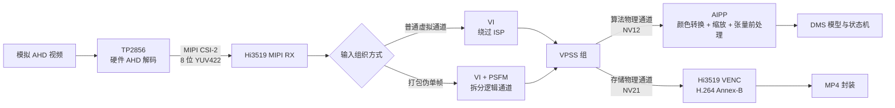
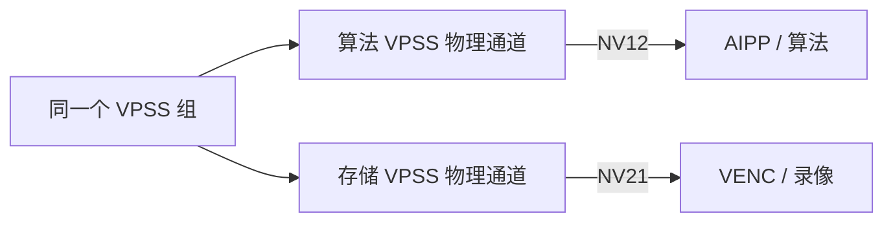
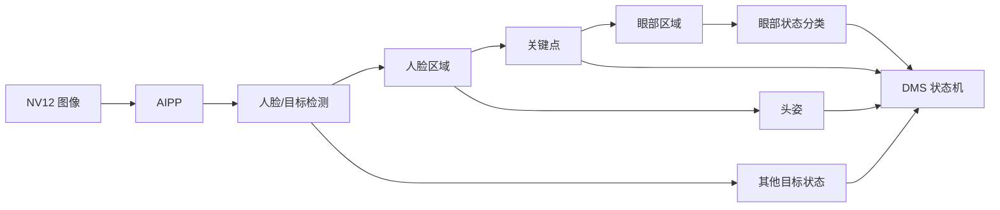
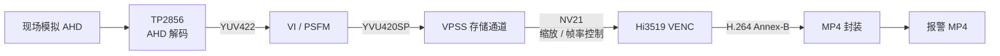

# DMS 媒体链路与算法图像接口

## 1. 结论

| 项目 | 结论 | 当前状态 |
|---|---|---|
| 算法图像格式 | **YUV420SP，即 NV12；Y 平面之后为 UV 交错平面** | `devlop-v2.0.2.x` 源码调用链已明确；板端需绑定实际 `mediad` 版本并读取运行时属性 |
| 存储编码图像格式 | **YVU420SP，即 NV21；Y 平面之后为 VU 交错平面** | 目标分支的存储 VPSS 通道配置已明确 |
| TP2856 输入 | 摄像头送入的是模拟 AHD 信号，不是 Hi3519 可见的 Bayer RAW | 媒体配置和板端驱动状态一致 |
| TP2856 输出 | MIPI CSI-2、8 位 YUV422 | MIPI RX、VI 与驱动配置一致；具体 YUV422 字节顺序仍需抓取数据核对 |
| TP2856 对图像的影响 | 会改变增益、黑电平、亮度、对比度、色度、锐度、噪声和失锁重锁瞬态；不是透明转接 | 功能路径和图像控制寄存器已定位，专有系数和动态规则仍需原厂资料或成对实验 |
| YUV422 到 YUV420 | 由 Hi3519 的 VI、PSFM 和 VPSS 硬件链路完成；不同输入组织方式的转换位置略有差异 | 各模块目标像素格式已明确 |
| MP4 视频编码 | 存储 VPSS 的 NV21 先由 Hi3519 VENC 硬件编码为 H.264 Annex-B，再封装为 MP4 | 编码与通用 MP4 打包实现已明确 |
| MP4 是否再次编码 | 否。MP4 层只处理视频轨、SPS/PPS、NAL 长度和 sample | 通用 MP4 打包实现已明确 |
| 视频盒子回灌 | H.264 解码后，经播放器/GPU、HDMI、盒子 AHD 编码、模拟链路和 TP2856 第二次解码，最终重新生成 NV12 | 与实时输入不逐像素等价，适合整机退化鲁棒性测试 |

最容易混淆的是算法通道与存储通道：二者来自同一个 VPSS 组，但使用不同的物理 VPSS 通道。存储通道的 NV21 状态不能代表算法通道的实际格式。

## 2. 总体数据流



各模块之间的数据格式如下：

| 边界 | 数据格式 | 说明 |
|---|---|---|
| 摄像头 → TP2856 | 模拟 AHD | 同轴模拟高清视频信号 |
| TP2856 → MIPI RX | 8 位 YUV422 | 已完成模拟视频解码，不是 Bayer RAW |
| VI/PSFM → VPSS | YVU420SP 为主要汇合格式 | 普通 VI 通道和 PSFM 输出均配置为 YVU420SP；特殊打包路径借用 VI 的 packed-YUV 枚举承载数据 |
| VPSS → 算法 | YUV420SP / NV12 | 算法通道显式覆盖为 UV 顺序 |
| VPSS → VENC | YVU420SP / NV21 | 存储通道保持 VU 顺序 |
| VENC → 录像服务 | H.264 Annex-B | 包含 SPS、PPS、IDR、P 等 NAL 单元 |
| 录像服务 → 文件 | MP4 | H.264 视频轨，可选 G.711 A-law 音频轨 |

## 3. TP2856 输入与解码

### 3.1 输入不是 Bayer RAW

摄像头内部的图像传感器可能产生 Bayer RAW，但该数据在摄像头内部已经过处理并被编码为 AHD 模拟信号。Hi3519 板端能够看到的第一层数据是 TP2856 解码后的 YUV422，因此本项目的媒体链路不包含 Bayer 去马赛克、白平衡或常规 Sensor ISP 成像流程。

源码中的 `RawTiming`、`RGB_BAYER_16BPP` 以及带 `YUYV_PACKAGE_422` 含义的特殊枚举，用于让 VI 接口承载打包 YUV422 或伪单帧数据。它们描述传输和内存组织方式，不代表输入重新变成了 Bayer RAW。

### 3.2 驱动与媒体服务的分工

板端实际加载的模块为 `ot_tp2856`，`/proc/modules` 中的 `(O)` 表明它是独立加载的外部内核模块。用户态设备节点为 `/dev/tp2802dev`。

职责划分如下：

- 系统启动流程加载 `ot_tp2856.ko` 并创建设备节点；
- `mediad` 打开 `/dev/tp2802dev`；
- `mediad` 通过 ioctl 查询输入状态和制式；
- `mediad` 通过 ioctl 设置 HDA、720p/1080p、25/30/50/60 Hz 和 MIPI 输出模式；
- 内核驱动把模式配置转换为 TP2856 寄存器操作。

设备节点沿用 TP2802 系列 ABI，节点名不能用来判断实际芯片型号。

### 3.3 TP2856 对图像内容的处理

TP2856 不是透明的信号转接器。它把模拟 AHD 信号恢复为数字 YUV422，期间会直接改变亮度、色度、噪声和边缘特征。

| 处理环节 | 对图像内容的作用 | 对算法输入的影响 |
|---|---|---|
| 输入检测与制式锁定 | 识别有无信号、视频制式、分辨率和帧率；失锁后重新检测并装载对应模式 | 重锁期间可能出现黑帧、花帧、亮度跳变、首帧不稳定或时间戳间断 |
| 模拟前端与均衡 | 补偿同轴线缆造成的幅度和高频衰减，并恢复采样时钟 | 改变整体增益、边缘幅度和噪声；线缆长度或质量变化会改变小目标清晰度 |
| AHD 解调 | 从模拟调制信号恢复亮度与色度分量，形成数字 YUV | 决定基础亮度、色度、同步稳定性和噪声形态 |
| 自动增益、钳位和黑电平 | 调整输入幅度、暗部基准和动态范围 | 改变 Y 分布、暗部细节、过曝/欠曝比例以及噪声水平；突亮问题不能只检查 brightness 寄存器 |
| 亮度控制 | 对 Y 分量施加偏移 | 整体变亮或变暗，影响暗部目标和阈值附近特征 |
| 对比度控制 | 调整 Y 分量相对中点的增益 | 改变局部对比度，可能造成黑白截断 |
| 饱和度与色调控制 | 调整色度幅度及 U/V 相位关系 | 改变彩色偏差；红外灰度图也可能因色度偏置出现紫色或绿色倾向 |
| 锐度与边缘处理 | 增强或抑制高频边缘 | 影响眼睛、嘴部、手机和手部等小目标；过强时产生振铃，过弱时造成模糊 |
| 通道复用与 MIPI 输出 | 按配置组织通道、帧头、lane 和 YUV422 输出 | 影响通道对应关系、帧组织和 YUV422 字节顺序，不负责生成 NV12 |

驱动接口已经体现信号状态查询、制式选择、视频模式配置、寄存器读写和 MIPI 输出控制；实际模块符号还显示存在增益相关处理路径。亮度、对比度、饱和度、色调和锐度寄存器也已在板端读取。

TP2856 的输出仍是 YUV422。YUV422→YUV420、NV21→NV12 和算法尺寸缩放由后续 Hi3519 VI、PSFM、VPSS 完成。因此，训练集与板端图像之间的差异不能全部归因于 AIPP，也不能把 VPSS 的 NV12/NV21 排列问题归因于 TP2856。

媒体源码和驱动表无法还原芯片内部的专有滤波器、均衡曲线、增益控制规则和色彩系数。以下参数需要 TP2856 原厂完整数据手册或成对寄存器实验补齐：

- 不同线缆和制式对应的均衡策略；
- 自动增益、钳位和黑电平的触发条件及时间常数；
- 锐度、降噪和色彩处理的实际系数；
- 失锁重锁后是否重新装载图像参数；
- MIPI YUV422 的最终 YUYV、UYVY、YVYU 或 VYUY 字节顺序。

## 4. Hi3519 接收与 YUV420 转换

### 4.1 MIPI RX 与 VI

MIPI RX 配置为 YUV422 输入，VI 配置为 ISP bypass。当前代码存在三种输入组织方式：

| 路径 | MIPI/VI 组织方式 | VPSS 前的输出 |
|---|---|---|
| 普通四路输入 | MIPI YUV422 虚拟通道，VI 使用 YUV timing | VI 通道输出 YVU420SP |
| 打包 YUV422 输入 | VI 使用 packed-YUV 相关枚举承载 | VI 通道按目标属性输出 YVU420SP |
| 伪单帧复用输入 | 带通道头和可变行的 packed YUV422 | PSFM 拆分后输出 YVU420SP |

YUV422→YUV420 的本质是垂直方向色度降采样：每两个垂直像素行共享一组色度样本。该过程由 Hi3519 媒体硬件完成，不是 CPU 软件逐像素转换。

### 4.2 PSFM 的作用

PSFM 只用于伪单帧复用输入。它读取帧中的通道头和行信息，将一个复用输入恢复为多个逻辑视频通道，并把每个通道以 YVU420SP 送入对应 VPSS 组。普通虚拟通道输入不经过 PSFM。

PSFM 的职责是拆分复用通道，不是算法前处理模块。

## 5. VPSS 分流与算法图像格式

### 5.1 算法和存储是独立通道



两个通道分别设置分辨率、帧率、缩放方式、像素格式和压缩模式。不存在“先进入 VENC，再从录像流取图给算法”的关系。

### 5.2 算法通道格式：NV12

算法 YUV 共享管线的创建顺序为：

1. 从 VPSS 组申请普通物理通道；
2. 设置算法输入尺寸和帧率；
3. 启用双线性缩放；
4. 准备通道属性时，默认像素格式为 `YVU_SEMIPLANAR_420`；
5. 双线性分支将目标像素格式覆盖为 `YUV_SEMIPLANAR_420`；
6. 调用 VPSS 设置通道属性；
7. 设置失败时，管线创建返回错误，不继续启动算法共享通道。

因此，目标分支中的算法通道目标格式是 NV12，而不是把 NV21 缓冲区简单改名。双线性缩放负责插值，`pixel_format` 属性负责指定输出的 UV/VU 排列；两项设置在同一分支中完成，但含义不同。

### 5.3 存储通道格式：NV21

VENC 存储管线独立申请 VPSS 物理通道，没有启用算法管线的双线性格式覆盖，因此沿用默认 `YVU_SEMIPLANAR_420`，即 NV21。

### 5.4 压缩模式与线性内存

像素格式与内存压缩是两个不同属性。当前物理 VPSS 通道 0/1 可能默认使用分段压缩，高编号通道则使用非压缩模式；算法侧存在按 `stride × height × 3/2` 使用连续内存的实现。

板端应记录以下运行参数：

- VPSS 组号和通道号；
- `pixel_format`；
- `compress_mode`；
- `video_format`；
- 宽、高和两个平面的 stride；
- 物理地址、共享内存句柄及缓存同步方式。

只有 `pixel_format=NV12` 且缓冲区为可线性访问的非压缩布局时，才能直接按 NV12 读取。

## 6. AIPP 与 DMS 算法

算法从共享媒体接口取得 NV12 图像后，由 AIPP 完成以下处理：

- NV12 到 RGB 或 BGR 的颜色空间转换；
- 图像裁剪与缩放；
- 通道顺序调整；
- 模型需要的归一化、量化或数据布局转换。

需要与训练侧保持一致的参数包括：

| 类别 | 参数 |
|---|---|
| 颜色 | NV12/NV21、BT.601/BT.709、Full/Limited range、RGB/BGR 顺序 |
| 几何 | 原始有效区域、裁剪、缩放尺寸、宽高比、插值和 padding |
| 张量 | NCHW/NHWC、数据类型、scale、mean/std、量化参数 |
| 图像状态 | mirror、flip、stride、压缩模式和缓存同步 |

`rbuv_swap_switch` 等开关只能在输入字节顺序和 AIPP 输出张量得到核对后调整，不能依据 VENC 通道显示的 NV21 状态修改算法配置。

DMS 的图像依赖顺序为：



上游图像格式、缩放或检测框发生变化时，会继续影响关键点、人脸区域、眼部裁剪和最终报警状态。

## 7. H.264 编码与 MP4 存储

### 7.1 视频编码

存储管线的数据流为：

```text
VPSS NV21
→ Hi3519 VENC
→ H.264 Annex-B
→ 共享编码流
→ MP4 打包器
```

目标分支的流配置解析固定选择 H.264，VENC 创建为 H.264 类型。分辨率、帧率、码率控制、GOP 和 profile 由媒体配置传入。编码工作由 Hi3519 VENC 硬件完成，输出包含 SPS、PPS、IDR、P 等 NAL 单元的 Annex-B 码流。

### 7.2 MP4 封装

通用 MP4 打包器执行以下操作：

1. 创建 MP4 文件；
2. 等待第一个包含 SPS 的 I 帧；
3. 根据分辨率、帧率和 SPS 信息创建 H.264 视频轨；
4. 从关键帧中提取并登记 SPS、PPS；
5. 取出 IDR 或 P 帧 NAL 单元；
6. 将 Annex-B 四字节起始码位置改写为大端 NAL 长度；
7. 将 NAL 写为 MP4 sample；
8. 可选添加 8 kHz、G.711 A-law、单声道音频轨。

MP4 封装阶段不执行第二次视频编码。H.264 是压缩编码格式，MP4 是容器格式。

当前代码能够说明媒体库的编码与封装方式；报警录像的预录缓存、文件分片、报警文件保护和索引策略由上层录像服务决定，尚未在本链路中闭合。

## 8. 报警 MP4 生成与视频盒子注入

报警录像生成和视频盒子注入是两个方向相反、但并不互逆的过程。报警 MP4 已经经过一次采集、色度降采样和 H.264 有损编码；视频盒子注入时又经过解码、显示输出、AHD 重新编码和 TP2856 再次解码，无法恢复为最初的算法 NV12。

### 8.1 报警 MP4 的生成链路



该过程可能引入以下变化：

| 位置 | 处理 | 不可逆或需要记录的变化 |
|---|---|---|
| TP2856 | AHD 解调、增益、黑电平、亮度/色度和边缘处理 | 模拟噪声、增益和锐度变化，无法从 MP4 反推原始模拟信号 |
| VI/PSFM | YUV422→YVU420SP、通道拆分 | 垂直色度分辨率减半；复用通道恢复可能影响首帧与时序 |
| VPSS 存储通道 | 输出 NV21，并按录像配置缩放、裁剪或降帧 | 存储分辨率、有效区域和帧序列可能与算法通道不同 |
| VENC | H.264 帧内/帧间压缩 | 块效应、振铃、纹理抹平、暗部损失；P 帧还依赖参考帧 |
| MP4 封装 | 写入视频轨、sample 和时间信息 | 不改变像素，但封装时间戳和播放帧率会影响回放节奏 |
| 报警录像服务 | 预录、分片、文件保护和索引 | 可能改变片段起点、首个关键帧、前后文长度；具体策略仍待上层服务核查 |

录像分支和算法分支从 VPSS 开始已经分开。即使二者来自同一个 TP2856 输入，存储图像也可能具有不同的尺寸、帧率、裁剪、叠加和压缩模式。因此，MP4 解码帧不能直接作为“当时算法实际输入帧”的替代品。

### 8.2 视频盒子注入链路

视频盒子回灌报警 MP4 时，完整链路为：


盒子注入阶段新增的处理如下：

| 环节 | 可能的转换 | 对算法的实际影响 |
|---|---|---|
| H.264 解码器 | MP4 sample→解码 YUV420，选择软件或硬件解码路径 | 保留原录像压缩损失；不同解码器在错误隐藏、色彩元数据处理上可能不同 |
| 播放器/GPU | YUV→RGB/YCbCr、BT.601/709、Full/Limited、缩放和画面合成 | 产生亮度偏移、黑白位截断、色偏、黑边和有效区域变化 |
| HDMI 输出 | RGB 或 YCbCr 4:4:4/4:2:2/4:2:0，固定分辨率和刷新率 | 可能再次改变色度采样、矩阵、range，并产生 25/30/50/60 Hz 变频 |
| HDMI→AHD 视频盒子 | HDMI 接收、缩放、帧率转换、数模转换和 AHD 调制 | 引入锐度、模拟带宽、噪声、幅度和同步变化；盒子不是透明转换器 |
| 同轴传输 | 模拟衰减、反射和外部噪声 | 改变高频细节、幅度和信噪比 |
| TP2856 再解码 | 再次执行均衡、增益、黑电平、AHD 解调和图像控制 | 在已有 H.264 损失基础上叠加第二套模拟解码特征 |
| VI/PSFM/VPSS | 再次执行 YUV422→YUV420 和算法缩放 | 再次色度降采样和插值，最终得到新的 NV12，而不是原算法帧 |

### 8.3 两个过程的主要差异

| 比较项 | 实时算法链路 | 报警 MP4 | 视频盒子重新注入 |
|---|---|---|---|
| VPSS 来源 | 算法独立通道 | 存储独立通道 | 重新采集后的算法独立通道 |
| 算法入口格式 | NV12 | 文件内为 H.264 压缩视频，解码后通常为 YUV420 | 最终重新生成 NV12 |
| H.264 损失 | 无 | 一次 | 保留一次录像损失 |
| AHD 编解码次数 | 一次 TP2856 解码 | 一次 TP2856 解码后录像 | 原录像的一次 + 盒子 AHD 编码 + 板端第二次 TP2856 解码 |
| YUV422→420 | 一次 | 录像分支一次 | 录像阶段一次，回灌采集阶段再次发生 |
| 缩放/插值 | 算法 VPSS/AIPP | 存储 VPSS，播放时还可能缩放 | 存储 VPSS + 播放器/GPU + 视频盒子 + 算法 VPSS/AIPP |
| 颜色矩阵/range | 板端媒体和 AIPP | 编码元数据与软件解码器参与 | 播放器、GPU、HDMI、盒子、TP2856 和 AIPP 多级参与 |
| 帧率与时间戳 | 设备采集 PTS | MP4 sample 时间轴 | 播放时间轴 + HDMI/AHD 变频 + 设备重新采集 PTS |
| 模拟噪声 | 现场摄像头至 TP2856 一段 | 被固化在压缩视频中 | 固化噪声之外，再增加视频盒子至 TP2856 的模拟链路噪声 |
| 适用目的 | 生产输入 | 事件回看和软件复现 | 整机接口与鲁棒性测试 |

视频盒子回灌能够验证系统在“经过录像和再注入后的退化视频”上是否仍工作，但不能证明它与现场实时输入逐像素一致。若回灌能够复现报警，说明退化后的场景仍触发相同逻辑；若不能复现，需要分别检查存储分支、H.264 压缩、播放输出、视频盒子和时间轴，不能直接判定模型错误。

### 8.4 OpenCV 直接解码

当前 OpenCV 启用了 FFmpeg，`VideoCapture` 读取 MP4 时通常执行：

```text
MP4 解封装 → H.264 解码 → YUV 到 BGR 转换 → OpenCV BGR Mat
```

它绕过播放器、GPU、HDMI、视频盒子、模拟链路和 TP2856，只保留存储分支及 H.264 压缩影响。若直接把 BGR 送入模型，还会绕过实时的 NV12→AIPP 颜色转换。

更接近板端前处理的数字回放方式是：FFmpeg 解码后只转换一次为线性 NV12，再进入原 AIPP。该方式仍无法消除录像分支与 H.264 编码造成的差异。

## 9. 训练集、测试集与模型鲁棒性

### 9.1 数据域划分

训练和测试数据应按来源分层管理，不能把 MP4 截帧、盒子回灌帧和实时算法帧视为同一分布。

| 数据域 | 数据来源 | 包含的处理 | 主要用途 |
|---|---|---|---|
| 实时算法域 | 板端算法 VPSS 的 NV12，或 AIPP 后张量/图像检查点 | TP2856 + VI/PSFM + 算法 VPSS + AIPP | 训练/验证部署一致性的主基准 |
| 存储视频域 | 报警 MP4 直接解码帧 | 存储 VPSS + H.264 编码/解码 | 衡量录像压缩和存储分支差异，复现报警片段 |
| 盒子回灌域 | 报警 MP4 经 HDMI/AHD 盒子重新注入后，在算法入口采集 | 存储、编码、播放、HDMI/AHD、第二次 TP2856 和算法链路 | 整机回归、接口兼容和退化鲁棒性测试 |
| 合成增强域 | 对基准图像施加可控变换 | 人工亮度、对比度、模糊、噪声、色偏、压缩和几何扰动 | 覆盖已知变化并建立性能退化曲线 |

训练数据应优先包含真实算法域样本。仅用 MP4 解码帧训练，模型会学习存储分支和 H.264 压缩后的分布；仅用盒子回灌帧训练，还会把特定播放器、GPU 和视频盒子的特征固化到模型中。存储域和回灌域适合作为补充域和独立测试集，不应替代实时算法域基准。

### 9.2 模型应具备的鲁棒性

| 变化类型 | 建议覆盖方式 | 需要观察的模型结果 |
|---|---|---|
| 亮度、对比度和黑电平变化 | 真实日夜/红外样本，加受控亮度、gamma、对比度和截断增强 | 检测召回、关键点误差、眼部分类和头姿偏差 |
| 轻度色偏和饱和度变化 | 使用 TP2856/矩阵/range 可能产生的有限色偏，不使用任意强色彩增强 | 彩色模型与灰度模型的敏感度、各通道统计和误报率 |
| 模拟噪声和线缆衰减 | 多线缆长度、不同信号质量，并增加带限噪声和轻度高频衰减 | 小目标、眼睛、嘴部、手机和手部的召回变化 |
| 锐化、振铃和模糊 | 采集不同 TP/盒子锐度状态，配合轻度 blur/sharpen/ringing 增强 | 边缘相关检测框、关键点稳定性和分类置信度 |
| H.264 压缩 | 多码率、GOP、关键帧位置和场景运动强度 | I/P 帧分别统计，关注块效应和纹理抹平 |
| 多级缩放与插值 | 覆盖真实目标尺寸、不同插值和小范围有效区域变化 | 小脸、小眼部 ROI 和远距离目标性能 |
| 少量重复帧、丢帧和帧率变化 | 固定内容下做 25/30 Hz、重复/丢帧和 PTS 抖动测试 | DMS 状态机持续时间、报警延迟和解除时间 |
| AHD 失锁重锁瞬态 | 真实插拔、弱信号和恢复过程，单独标注过渡帧 | 质量门控、误报抑制和恢复时间 |

鲁棒性范围必须由实际设备分布和业务容差确定。训练增强需要保留参数、概率和样本来源，测试集必须包含未参与调参的设备、线缆、播放器和视频盒子组合。

### 9.3 不应由模型兜底的问题

以下问题属于媒体接口或实现错误，应在进入模型前修正：

- NV12 数据按 NV21 解释，或反之；
- BT.601/BT.709、Full/Limited range 配置错误；
- RGB/BGR 通道顺序错误；
- 使用 `width × height` 代替 `stride × height` 定位色度平面；
- 将分段压缩缓冲区按线性 NV12 读取；
- crop、mirror、flip、宽高比或坐标映射错误；
- 同一变换在 VPSS、AIPP 和 CPU 侧重复执行；
- 播放器或视频盒子输出格式未固定。

把这些错误加入训练增强会掩盖媒体链路缺陷，并降低正常输入上的有效容量。

### 9.4 最小测试矩阵

同一组带标注片段至少执行以下测试：

1. 实时算法域：板端原始 AHD 输入；
2. 存储视频域：同一事件的报警 MP4 直接解码；
3. 前处理对齐回放：MP4→FFmpeg→NV12→原 AIPP；
4. 盒子回灌域：固定播放器、HDMI 输出和 AHD 盒子；
5. 压缩扫描：多个码率/GOP；
6. 颜色扫描：矩阵、range 和有限亮度/色度扰动；
7. 几何扫描：目标尺寸、插值、黑边和裁剪；
8. 时序扫描：帧率、重复帧、丢帧和 PTS 抖动。

每一层都记录检测框、关键点、分类分数、头姿、状态机转移和报警时间。比较结果按模块依赖顺序定位，不能只比较最终报警是否一致。

## 10. TP2856 亮度寄存器实测

板端对两颗 TP2856、每颗四个 decoder page 读取了五个图像控制寄存器，八路结果一致：

| 参数 | 运行时读值 |
|---|---|
| brightness | `0x00` |
| contrast | `0x40` |
| saturation | `0x40` |
| hue | `0x00` |
| sharpness | `0x00` |

该次快照未发现某一路静态图像参数与其他通道不同。初始化表中出现过另一组候选值，说明运行阶段存在后续覆盖，初始化值不能代表最终状态。

亮度突变问题仍需在同一输入条件下保存正常画面和异常画面的成对记录，同时读取：

- 上述五个图像控制寄存器；
- decoder lock、制式和重锁状态；
- AGC、增益、钳位和黑电平状态；
- VI 与算法 VPSS 的 Y/U/V 统计；
- PTS、温度、供电和输入源状态。

若五个寄存器保持不变，应把排查重点转向 AGC、增益、钳位、黑电平、失锁重锁以及摄像头照明/光学链路。

## 11. 版本与待核查项

### 11.1 适用版本

- 媒体源码分支：`devlop-v2.0.2.x`；
- 板端实际驱动模块：`ot_tp2856`；
- 用户态控制节点：`/dev/tp2802dev`；
- 参考材料：《DMS 输入图像对齐》《DSM - 媒体视频流 pipeline 核查》；
- MP4 回放入口：启用 FFmpeg 的 OpenCV。

板端 `ot_tp2856.ko` 与早期分析使用的 `hi_tp2856.ko` 文件摘要不同，后者只能作为同系列驱动结构参考。板端模块参数与目标分支部分枚举值也曾出现不一致，因此运行结果必须同时记录固件、驱动、`mediad` 和配置版本。

### 11.2 待核查项

1. 板端运行的 `mediad` 是否确由 `devlop-v2.0.2.x` 对应构建产生；
2. 算法实际 VPSS 组/通道的 `pixel_format`、压缩模式和 stride；
3. 已知色条下的 UV/VU 字节顺序；
4. MIPI/VI 边界的 YUV422 具体字节顺序；
5. AIPP 的颜色矩阵、range、通道顺序、缩放与归一化参数；
6. 报警录像服务对预录、分片、文件保护和索引的处理；
7. 播放器、GPU、HDMI 和视频盒子的输出格式、矩阵、range、缩放与帧率转换；
8. TP2856 正常/亮度突变时的成对寄存器和状态记录；
9. 实时算法域、存储视频域和盒子回灌域的同事件对照数据。
