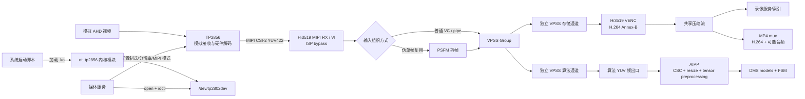
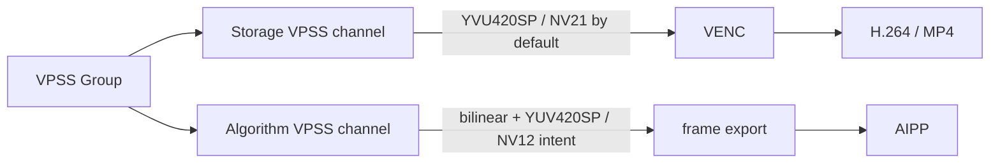
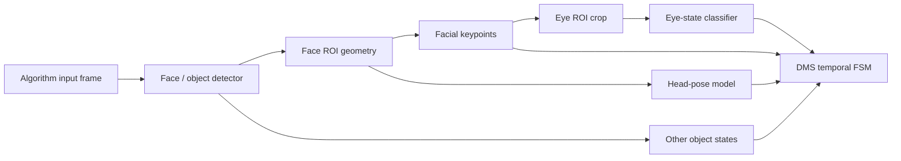
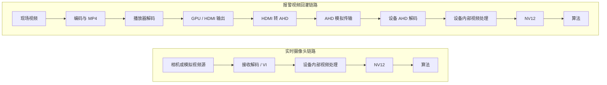
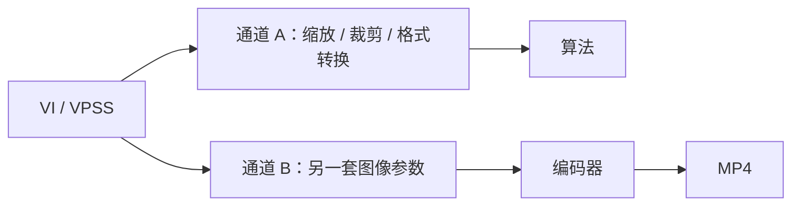
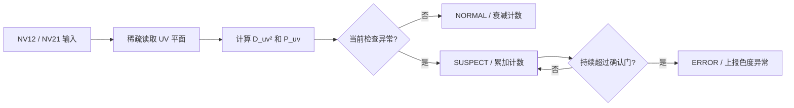

# IR camera input-chain reproduction and chroma anomaly diagnostics

## Evidence boundary

本条目由 IR 摄像头、报警视频回灌和 NV12 输入异常排查对话抽象而来，并在 2026-08-12 综合了《DMS 输入图像对齐》内部文档、Hi3519 媒体服务目标分支的只读源码审查以及设备侧模块观察。源码审查可以确认软件配置意图和模块连接，但不能替代板端返回值、帧元数据、原始字节和算法张量实测；内部文档中的图示、判断表和数据集颜色统计仍属于项目观察，不是独立 Oracle。

当前没有导入原始 NV12、TP2856 完整数据手册/寄存器表、驱动源码、连续日志、视频注入盒子实测数据或多设备统计。因此本文状态仍为 `working`、`owner_review: pending`、`ip_review: pending`。内容只记录理解和复现链路所必需的模块合同，不复制公司源码、内网链接、数据路径或客户信息；公开、晋级或提取到公共项目之前必须完成独立实验和 IP 审查。

### Evidence register

| Evidence | What it currently supports | Boundary |
|---|---|---|
| Hi3519 媒体服务目标分支源码审查 | TP2856 用户态接口、VI/PSFM/VPSS 连接、算法/存储通道属性、VENC 和通用 MP4 封装意图 | 未在目标板复核全部 MPI 返回值、通道分配和运行时帧属性 |
| 《DMS 输入图像对齐》2026-08-12 版本 | DMS 模块拆解、直接解码/盒子回灌判定矩阵、训练—部署核对项、数据集颜色分布观察 | 内部文档；部分表格尚未填完，统计缺少独立复算记录 |
| 设备侧观察：`/proc/modules` 出现 `ot_tp2856` | TP2856 是已加载的独立内核模块，而非内建驱动 | 当前条目未保存原始命令输出、模块版本和加载脚本 |
| OpenCV+FFmpeg 回放说明 | 当前 MP4 直接解码入口和待核对假设 | 仍需保存 OpenCV build information、实际 `Mat` 类型和下游调用证据 |
| 指定的另一段 ChatGPT 对话 | 据称包含 TP2856 对应测试 | 当前链接需要登录态，正文尚未导入，不能吸收或引用其结论 |

## Source-supported platform chain and module boundaries

下图是目标分支 `devlop-v2.0.2.x` 源码支持的**平台实现图**。它比概念图更严格地划分了驱动、媒体处理、存储和算法边界：



### Driver and media-service boundary

- `ot_tp2856` 是内核模块；驱动加载不在媒体服务源码中完成。媒体服务启动前，系统必须已经加载模块并创建 `/dev/tp2802dev`。
- 媒体服务打开该设备节点，通过 ioctl 查询信号/制式，并按通道配置 HDA、720p/1080p、刷新率和 MIPI 输出模式。
- `/dev/tp2802dev` 是沿用 TP2802 系列用户态 ABI 的节点名，不能据此推断实际芯片不是 TP2856。
- 当前用户态代码在 `open` 失败时主要记录日志，没有建立强制启动门；因此“媒体进程存活”不能作为驱动可用 Oracle。必须同时检查设备节点、ioctl 返回值和 MIPI/VI 是否持续出帧。

### TP2856 test evidence intake

尚未导入的 TP2856 测试不能只记录“正常/异常”结论。每组测试至少补齐：

| Field | Required evidence |
|---|---|
| Environment | 板卡/固件、`ot_tp2856` 模块版本、媒体服务版本、温度与供电 |
| Input | 信号源、AHD 制式、分辨率、FPS、线缆/注入方式、标准测试图或真实片段 |
| Driver configuration | channel、mode、standard、MIPI output，以及相关 ioctl 返回值；寄存器仅在权属允许时保存摘要 |
| Capture checkpoints | TP2856/MIPI YUV422、VI/PSFM、存储 VPSS、算法 VPSS、AIPP 后 tensor 中能取得的最早检查点 |
| Image contract | packing、width/height、stride、UV/VU、matrix/range、crop/scale、mirror/flip、compression |
| Time contract | PTS、实测 FPS、失锁/重锁、重复/丢帧及首次稳定帧 |
| Oracle | 色条/灰阶的数值误差、几何坐标、模型 raw output 与 FSM，而非“肉眼正常” |
| Conclusion boundary | 当前排除/支持了什么，哪些替代解释仍存活 |

对话导出后，应把每个 TP2856 测试映射到该表，并链接合法保存的原始输出；没有环境和原始观测的聊天结论只能保留为 hypothesis。

### What “RAW” means in this path

TP2856 已经在芯片内部完成模拟视频接收和解码，向 Hi3519 输出的是数字 YUV422，而不是 Bayer RAW。VI 的某些 “raw timing” 路径使用 Bayer/packed-YUV 相关枚举承载时序或打包数据，这是接口配置手段，不能把该数据解释成传感器 Bayer 图像，也不意味着后续运行完整 ISP Bayer pipeline。

TP2856 内部究竟使用哪套均衡、AHD 解调、亮色分离、色彩矩阵、range 和寄存器系数，当前源码无法证明。需要后续核查 `ot_tp2856` 驱动寄存器表或原厂完整数据手册；在此之前只能确定“硬件模拟视频解码后输出 YUV422”，不能给内部 DSP 方法下更细结论。

### Ordinary VI and PSFM variants

- 普通输入以 MIPI 虚拟通道进入各 VI pipe，再绑定对应 VPSS group。
- 部分复用输入使用带通道头和可变行的伪单帧格式；PSFM 根据头字段恢复通道，再输出 YVU420SP 给独立 VPSS group。
- 两种组织方式最终都应在 VPSS 输出边界统一验证：不能因为上游 pipe 使用了不同 timing/枚举，就在算法层假定颜色和内存合同相同。

## VPSS fork: storage and algorithm are sibling paths

存储流和算法流不是串行关系。它们从同一个 VPSS group 申请不同的物理通道，各自设置分辨率、帧率、像素格式和压缩属性：



| Contract | Storage channel | Algorithm YUV channel |
|---|---|---|
| Channel ownership | VENC pipe 独立申请物理 VPSS channel | YUV share pipe 独立申请物理 VPSS channel |
| Size | 编码 profile 的分辨率 | 算法 YUV profile 的分辨率 |
| Scale coefficient | 当前编码管线未显式启用算法侧双线性设置 | 显式启用双线性设置 |
| Default pixel format | YVU semiplanar 420，即 NV21（Y + VU） | 双线性分支把目标格式设为 YUV semiplanar 420，即 NV12（Y + UV） |
| Consumer | Hi3519 VENC | 共享 YUV 取帧接口，再进入 AIPP |
| Key verification | VENC 输入帧属性和实际录像解码 | `video_frame.pixel_format`、stride、压缩模式和 UV 字节探针 |

VPSS channel attribute 中的 `pixel_format` 是**目标图像格式**。因此在 `set_chn_attr` 成功后，随后由 VPSS 产生的输出 Buffer 应按 NV12 写入，而不是只把既有 NV21 Buffer 改名。双线性缩放本身并不天然完成 NV21→NV12；当前实现是在同一条件分支中同时选择双线性系数和 NV12 目标格式。这个结论仍需用 MPI 返回值、返回帧的 `pixel_format` 和字节 dump 三重验证。

另有一个必须单独关闭的风险：物理 VPSS channel 0/1 默认可能使用 segment compression，而高编号通道改为无压缩；算法当前按线性 `stride × height × 3/2` 映射帧。若运行时动态分配到压缩通道，单看 `pixel_format` 不足以证明 Buffer 可按线性 NV12 读取。必须记录实际 group/channel、`compress_mode`、`video_format`、两个平面地址与 stride，或显式保证算法通道无压缩。

### Resolution of the initial YVU/NV12 discrepancy

内部文档早期根据 VENC/媒体状态把“0～7 路媒体输出为 YVU420SP”与“AIPP 声明 YUV420SP”直接比较，得到算法输入不一致的候选判断。源码审查表明这个比较混合了两个不同 VPSS channel：VENC 状态只能说明**存储编码通道**的输入合同，不能证明**算法共享通道**仍是 NV21。算法通道在创建时显式进入双线性分支，并把目标格式改为 NV12。

因此当前应撤销“仅根据 VENC 状态就修改 AIPP UV swap”的行动依据。正确判断顺序是：

1. 记录算法实际分配到的 VPSS group/channel；
2. 检查该 channel 的 set-attribute 返回值和 get-attribute 结果；
3. 检查返回帧的 pixel/compress/video format、stride 和 plane 地址；
4. 对中性色块或已知色条做 UV 字节探针；
5. 比较 AIPP 后 RGB/BGR tensor，而不是只看最终渲染图。

只有这些证据证明算法收到 VU 数据却按 UV 解释时，才允许改变 swap 或输入格式声明。

## Encoding, MP4 and alarm-recording boundary

当前目标分支的存储视频 profile 固定进入 H.264 硬件编码路径；分辨率、FPS、码率控制和 GOP 必须以实际设备配置为准。VENC 从独立 VPSS 存储通道取 YUV420SP，输出包含 SPS/PPS/IDR/P 的 Annex-B 码流。H.264 压缩由 Hi3519 VENC 完成；将压缩视频与音频写入 MP4 是 mux，不是再次编码。

源码中可以确认一个通用 MP4 打包器会：等待首个含 SPS 的 I 帧、建立 H.264 track、写入 SPS/PPS、把 Annex-B 起始码改为 MP4/AVCC 的 NAL 长度前缀，再写 sample；音频路径可添加 G.711 A-law track。当前代码集合不含录像服务主体，因此尚不能证明报警录像落盘是否直接调用这个打包器、分片长度、预录缓存实现，以及报警究竟是复制文件、保护已有分片还是只写索引。应把“VENC 编码方法已确认”和“报警存储策略待查”分开。

## Algorithm image modules and dependency chain

“DMS 算法”不是单一模型。图像输入差异会沿 ROI 和时序依赖传播：



因此“某个旧眼部模型看起来不受偏色影响”不能推出输入链路正确：关键点偏移会先改变眼部 ROI，分类器随后接收到的已经不是同一裁剪。需要按依赖顺序保留中间证据，而不是只比较最终报警。

| Module | Image contract to freeze | Intermediate Oracle |
|---|---|---|
| Face/object detection | 整帧有效区域、resize/letterbox、RGB/BGR/灰度、归一化、量化 | 输入 tensor hash/统计、框坐标、raw score |
| Keypoints | face ROI 坐标系、crop 边界、插值、通道和 normalization | ROI 图、关键点坐标和置信度 |
| Head pose | ROI 定义、角度约定、镜像状态、前处理 | 输入 ROI、连续角和阈值前输出 |
| Eye-state classification | eye ROI 来源、左右眼顺序、crop padding、灰度/彩色、resize | 左右眼 ROI、logit/probability |
| FSM/alarm | PTS、实际 FPS、重复/丢帧、阈值、持续时间 | 每帧状态、计数器、状态迁移原因 |

内部文档中的训练集统计显示，不同子模型的数据颜色分布可能显著不同：关键点/头姿数据可能包含更强彩色偏置，而部分眼部分类数据更接近灰度。该观察提示模型通道敏感性可能不同，但不能直接解释板端异常；晋级前必须在合法、可复算的数据快照上重新统计，并分别做 RGB/BGR、Y-only、通道置换和统一 normalization 的控制实验。

## Training-to-board preprocessing contract

对每个模型必须填满下面的合同，空项即阻塞“已经对齐”的结论：

| Stage | Required fields |
|---|---|
| Training decode | decoder/version、EXIF orientation、RGB/BGR/gray、alpha handling |
| Training geometry | source ROI、crop/pad/letterbox、target size、interpolation、rounding |
| Training tensor | layout、dtype、channel order、scale、mean/std、value range |
| Model conversion | declared input format、static/dynamic AIPP、quantization calibration input |
| VPSS export | group/channel、width/height、pixel format、stride、compress/video format、crop、mirror/flip |
| AIPP CSC | NV12/NV21 interpretation、BT.601/709、full/limited range、CSC coefficients/offsets |
| AIPP geometry | crop、resize target、interpolation、padding and aspect-ratio policy |
| Runtime tensor | final layout/dtype/channel order、normalization、tensor address/size |

`rbuv_swap_switch` 之类的开关不能仅凭名字视为修复：必须先确认 AIPP 官方语义、实际输入字节和最终 RGB tensor。一次实验只能改变“数据排列”或“格式/交换声明”中的一个变量，禁止数据先交换一次、接口又反向解释一次。

## Problem

实时摄像头输入与报警视频回灌经过不同的视频链路，即使最终都以 NV12 送入算法，实际像素、几何、帧序列和系统时序也可能不同。若直接把“回灌不能复现”归因于模型，会把编码、颜色解释、视频制式、AHD 解码或业务时序问题误判为感知问题。

典型链路如下：



现场通常不能持续保存原始 NV12：未压缩数据占用空间大，帧复制、缓存同步和落盘还可能改变算法帧率、线程调度和原问题现场。因此诊断方案不能依赖“长期保存全部原始帧”。

## Goal and non-goal

### Goal

- 找到两条链路的**首个显著分歧边界**；
- 区分感知、判决和系统三类问题；
- 在不持续保存 NV12 的条件下保留足够证据；
- 标定播放器、HDMI、注入盒子和 AHD 接收链路；
- 建立 IR 灰度/色度异常的低成本运行时检测；
- 将可控偏差固定，将不可逆偏差纳入容差和回滚条件。

### Non-goal

- 不承诺实时链路和回灌链路逐像素一致；
- 不从单张截图直接证明 IR-cut、ISP 或 UV/VU 是根因；
- 不用视觉上“更清楚”替代下游检测和报警 Oracle；
- 不用一组设备或两张图冻结量产阈值。

## Three problem classes

| 类别 | 典型表现 | 优先检查 |
|---|---|---|
| 感知问题 | 框偏移、漏检、分数下降、ROI 模糊或偏色 | 输入字节、颜色、缩放、编码、AHD 处理 |
| 判决问题 | 单帧接近但报警时间不同 | FPS、PTS、重复帧、丢帧、FSM 和持续时间 |
| 系统问题 | 帧率波动、加日志后现象变化、不同设备结果不同 | 队列、线程、内存带宽、版本和设备配置 |

误报成本高时，运行时相机异常监测应优先采用“记录/降级/延迟确认”，不能由单帧异常立即阻断正常推理。

## Competing explanations

### 1. 编码前已经不是同一输入

VI/VPSS 可能分别向算法和编码器提供不同通道：



必须逐项核对：物理帧、PTS、分辨率、stride、crop、镜像/翻转、帧率、色彩处理、降噪、锐化、OSD 和编码前输入。若这里已经分歧，调整注入盒子不能恢复现场输入。

### 2. MP4 有损编码

H.264/H.265 可能引入块效应、纹理涂抹、边缘振铃、暗部损失、色度降采样以及 I/P/B 帧质量差异。小人脸、眼睛、嘴部、手机、手部和低对比度边缘最容易跨越检测阈值。

### 3. 播放器、GPU 和 HDMI 颜色解释

链路可能在 RGB Full、RGB Limited、YCbCr 4:4:4/4:2:2/4:2:0、BT.601/BT.709 和 Full/Limited 之间转换。像素格式、颜色矩阵和 range 是不同合同，不能因为最终是 NV12 就推断上游解释一致。

### 4. HDMI 转 AHD 和模拟链路

注入盒子不是透明转接头，通常包含 HDMI 接收、色彩转换、缩放/变频、AHD 编码和模拟输出。AHD 传输还可能引入高频衰减、噪声、同步抖动和信号幅度差异。

### 5. 设备 AHD 解码器

解码器可能执行 AGC、黑电平、亮度、对比度、饱和度、锐化、2DNR/3DNR、边缘增强、crop、scaler 和 YUV422→YUV420。信号重新锁定后还可能加载另一套参数。

### 6. 几何和时序

多次缩放、黑边、overscan、裁剪和宽高比变化会改变小目标像素尺寸。25→30、25→60、30→60 等变频可能产生重复帧或丢帧，并直接改变连续帧 FSM。

### 7. NV12/NV21 与内存合同

需要明确 UV/VU 顺序、stride、宽高对齐、连续/双平面内存、DMA/物理地址与 CPU 虚拟地址。错误的格式声明、重复交换或用 `width * height` 代替 `stride * height` 定位 UV 平面都可能造成输入异常。

## Diagnostic hierarchy

### Layer 1: MP4 direct-decode reproduction

```text
报警 MP4
→ 固定 demux/decode
→ 恢复时间轴
→ 按算法输入合同生成图像或 tensor
→ 算法
```

这一层绕过播放器、HDMI、注入盒子和 AHD 接收。若仍不能复现，优先检查编码前分支、编码损失、PTS/FPS 和算法版本；此时继续调盒子没有诊断价值。

#### Current OpenCV+FFmpeg path

`cv::VideoCapture::read()` 在通常配置下返回 `CV_8UC3` BGR `Mat`。FFmpeg 已经完成 MP4 demux 和 H.264 decode，OpenCV/FFmpeg 还会把解码 YUV 转成 BGR。它可以做报警逻辑的快速功能复现，但不等价于实时链路的 `VPSS NV12 → AIPP CSC/resize → tensor`：

```text
实时：VPSS NV12 → AIPP YUV-to-RGB/BGR + resize → model
回放：MP4 → FFmpeg decode → OpenCV BGR → downstream preprocessing → model
```

如果 OpenCV BGR 直接送给 RGB/BGR 模型入口，应关闭或绕过 AIPP 的 YUV CSC，并证明 resize、channel order 和 normalization 与训练/板端一致。如果先把 BGR 转回 NV12 再走原 AIPP，会多出 `YUV → BGR → NV12 → RGB/BGR`，引入额外量化和色彩矩阵误差；它只能作为近似回放，不能作为像素级基准。

更严格的数字复现应使用 FFmpeg 原生帧接口保留 `AVFrame` 的 format、planes、linesize 和 PTS：解码输出若不是线性 NV12，应显式转换一次为算法所需 NV12，再走与实时相同的 AIPP。MP4 中的 H.264 sample 通常采用 AVCC 长度前缀；只有直接向 Hi3519 VDEC 喂压缩包时才需要正确完成 demux、访问单元组装及必要的 AVCC→Annex-B 转换。OpenCV 已经解码成 BGR 时，不应再把 `Mat.data` 当 H.264 或 NV12。

建议把数字回放分为三个清楚命名的等级：

| Replay level | Path | What it can prove |
|---|---|---|
| L1A functional | MP4 → OpenCV BGR → matched RGB/BGR preprocessing | 场景信息和大部分算法/FSM 是否仍可复现 |
| L1B preprocessing-aligned | MP4 → FFmpeg frame → one conversion to linear NV12 → original AIPP | 尽量隔离 OpenCV CSC/resize 与 AIPP 差异 |
| L1C pixel checkpoint | 保存少量实时算法入口 NV12 与 AIPP 后 tensor | 逐阶段定位 VPSS、CSC、resize 或 tensor 差异；不要求现场持续录像 |

每次运行至少打印/保存：OpenCV/FFmpeg 版本、codec/pix_fmt/color_space/color_range、宽高、`Mat.type/channels/step`、帧 PTS、实际送算法时间，以及各模型首个输入 tensor 的 shape/dtype/channel statistics。

### Layer 2: full-device replay

```text
同一 MP4
→ 固定播放器和显示输出
→ HDMI 转 AHD
→ 设备采集与解码
→ NV12
→ 算法
```

将这一层与直接解码比较，用于测量回灌链路的附加偏差。只有标定稳定后，它才适合作为整机回归入口。

### Layer 3: low-cost field evidence

现场不持续保存 NV12，只保存：

- 报警 MP4；
- `frame_id`、PTS、实际帧间隔和丢帧状态；
- 检测框、原始分数、关键分类分数和质量过滤原因；
- FSM 状态和最终报警状态；
- 输入、VI/VPSS、编码器、算法、模型和设备版本快照。

日志应使用预分配有界队列异步写入；算法线程只入队，队列满时允许丢诊断记录，不允许阻塞推理。

## Controlled experiments

## A. NV12/NV21 handling in the inference path

控制变量是同一应用输入流，仅改变推理路径中的 UV/VU 处理。必须区分：

1. 真正交换色度字节；
2. 数据不变，只改变格式声明。

一次实验只能改变其中一项，避免“数据交换一次、接口又反向解释”的双重转换。

建议四组：

| 组别 | 数据排列 | 格式声明 | 用途 |
|---|---|---|---|
| A | UV | YUV420SP / NV12 | 正确基线 |
| B | VU | YVU420SP / NV21 | 正确等价路径 |
| C | UV | YVU420SP / NV21 | 故意错配 |
| D | VU | YUV420SP / NV12 | 故意错配 |

先比较 A 与 B；若正确处理后仍明显不同，说明两条前处理实现并不等价。再比较 C/D 是否能复现现场偏色或检测变化。比较顺序为：实际输入字节 → 转换后 RGB/模型张量 → 原始网络输出 → 检测框与分数 → 业务状态。

## B. Replay-box calibration

使用标准测试视频，而不是只看真实报警片段：

- 灰阶块与连续 ramp；
- 色条；
- 1/2/4 像素线条和棋盘格；
- 每帧变化的帧号；
- 固定速度移动方块；
- 多尺寸小目标和典型局部 ROI。

检查：

| 维度 | 指标 |
|---|---|
| 几何 | 有效区域、黑边、裁剪、缩放比例、坐标偏移 |
| 亮度 | Y 直方图、黑位、白位、截断、灰阶映射稳定性 |
| 色度 | U/V 中心、饱和度、UV/VU 和矩阵/range 解释 |
| 清晰度 | 边缘宽度、梯度能量、高频损失、振铃和过锐化 |
| 时序 | 实际 FPS、重复帧、丢帧、首帧偏移和播放速度 |
| 算法 | 框 IoU、分数差、分类差、FSM 和报警时间 |

播放器版本、解码方式、显示缩放、HDR、驱动增强、HDMI 分辨率/刷新率和颜色输出必须固定。

## Sudden IR image color or luminance shift

IR 画面突然从偏紫/深色变为浅色/中性灰，至少存在以下竞争解释：

1. **ISP 日夜或 IR profile 切换**：饱和度、AWB、CCM 或黑白模式发生变化；
2. **机械 ICR/IR-cut 动作异常**：滤光片卡滞、切换不到位或偶发释放；
3. **IR LED、AE 或增益变化**：主要改变亮度和噪声，但不能单独解释所有色度归中；
4. **AHD 解码器失锁/重锁**：重新识别制式并加载另一套寄存器；
5. **仅录像或播放侧变化**：两个独立文件的编码元数据或播放器路径不同。

### Distinguishing ICR from ISP and illumination

先确认相机是否真的存在机械 ICR；部分专用 IR 相机采用单色 Sensor 和固定窄带滤光片，没有可移动机构。

若存在机械 ICR：

1. 关闭自动日夜切换，强制 Day/Night 循环；
2. 固定 IR LED，只切换 ICR；
3. 固定 ICR，只切换 IR LED；
4. 同步记录机械声、GPIO/驱动脉冲、线圈电流、Y 均值、曝光和增益；
5. 检查温度、振动和低电压条件下是否偶发失败。

| 控制证据 | 机械/图像表现 | 候选判断 |
|---|---|---|
| 无驱动脉冲 | 无动作 | 软件、GPIO 或驱动电路 |
| 有正常脉冲 | 无机械动作 | 线圈或机构卡滞 |
| 有动作声 | 图像不变化 | 滤光片行程、脱落或 ISP 不同步 |
| 动作正常但画面模式错误 | ISP/AWB/饱和度异常 | 不是单纯机械卡滞 |

机械卡滞的正式处理通常是更换 ICR 模组或相机；敲击、反复重启或外部磁力只能作为临时验证，不能作为量产修复。

## Runtime neutral-chroma monitor for NV12

正常灰度 IR 输入不应要求 `R == G == B`。YUV→RGB 取整、噪声和 ISP 偏置会产生小通道差。对于 NV12/NV21，更直接的健康指标是色度是否接近中性点：

```text
D_uv² = (mean(C0) - 128)² + (mean(C1) - 128)²
P_uv  = count(|C0-128| > T or |C1-128| > T) / sample_count
```

`C0/C1` 在 NV12 中对应 U/V，在 NV21 中对应 V/U。距离平方对通道交换不敏感，因此适合判断“是否保持近似灰度”，但不能识别输入究竟是 NV12 还是 NV21。

建议将 `D_uv²` 作为主指标，将 `P_uv` 作为防止局部噪声或均值抵消的辅助指标。阈值必须由多台正常相机、不同温度、曝光和场景的分布冻结；单次对话中得到的数值只能作为实验起点。

### Pointer and memory contract

连续 NV12/NV21 的 UV 平面通常为：

```cpp
const uint8_t* uv = nv12 + static_cast<size_t>(stride) * height;
```

必须使用 `stride`，不能假设 `stride == width`。若接口提供独立 `y_plane/uv_plane`，直接使用第二平面；若传入的是物理地址、DMA 地址、VB handle 或未同步的缓存，不能直接解引用，应先按平台合同获取 CPU 可访问虚拟地址并完成必要的 cache 同步。

### Low-cost sampling

候选低成本策略：

- 每 5 帧检查一次；
- UV 平面横纵稀疏采样；
- 连续多次异常后进入 `ERROR`；
- 单帧异常仅进入 `SUSPECT`；
- 只读取现有 Buffer，不转 RGB、不复制、不动态申请内存。

以 `640×360@25 FPS` 为例，完整 UV 平面约 115.2 KB/帧；逐帧完整读取约 2.88 MB/s。若横纵稀疏采样并每 5 帧检查一次，读取量可降到几十 KB/s。真正需要关注的是新增 mmap、DMA/cache 同步和 Buffer 复制，而不是整数累加本身。

### State machine



运行时上报应区分：

- `IR_CHROMA_ABNORMAL`：UV 明显偏离中性灰，候选原因包括 ISP profile、格式解释或解码参数；
- `IR_LUMINANCE_ABNORMAL`：Y 亮度突变、过暗或过曝，候选原因包括 IR LED、AE、ICR 和曝光链路。

色度指标不能单独证明滤光片卡滞；滤光片异常但 ISP 继续输出灰度时，RGB/UV 仍可能近似中性。

## Decision and acceptance matrix

| 观察 | 下一步 | 当前能区分什么 |
|---|---|---|
| 算法与编码器输入合同不同 | 先修正源分支 | 编码前差异与回灌差异 |
| MP4 直接解码已不能复现 | 排查编码、PTS 和源通道 | 编码前/编码侧与盒子侧 |
| 直接解码可复现，盒子不可复现 | 标定 HDMI/AHD/解码器 | 数字录像与整机注入链路 |
| 两种回放结果不同但趋势一致 | 按关键阈值与业务容差评估，不宣称等价 | 可用性与像素一致性 |
| 单帧结果接近，报警时间不同 | 改查 PTS/FSM | 感知与判决 |
| UV 色度突变但 Y 变化小 | 检查 ISP profile、饱和度和格式 | 色度模式与纯曝光变化 |
| Y 突变但 UV 仍中性 | 检查 IR LED、AE、ICR | 亮度链与色度链 |
| 控制脉冲正常但 ICR 无动作 | 更换机构并做环境复测 | 控制链与机械链 |

回灌链路的合理验收目标是：有效区域、几何比例、亮度映射、清晰度和帧序列稳定；模型分数不频繁跨越关键阈值；业务报警在冻结容差内一致。不可逆编码和模拟损失只能被控制，不能被宣称完全消除。

## Verification plan

晋级前至少需要：

1. 一套来源清楚、无敏感信息的直接解码与盒子回灌对照数据；
2. 标准灰阶、线条和帧号视频的标定结果；
3. 多设备、多温度和多曝光条件的 `D_uv²/P_uv/Y` 分布；
4. NV12/NV21 四组控制实验及实际输入字节证据；
5. ICR、IR LED、ISP 和 AHD 状态的同步日志；
6. 开启/关闭监控后的平均、P99 耗时、FPS 和误报统计；
7. OpenCV L1A 与 FFmpeg/AIPP L1B 的同帧对照，以及少量 L1C tensor checkpoint；
8. TP2856 测试原始记录：模块版本、输入制式、寄存器/驱动配置、YUV422 packing、颜色矩阵/range、失锁重锁状态；
9. 独立任务 Oracle：固定数据上的检测、分类和报警一致性。

指定的另一段 ChatGPT 对话正文尚不可访问；其中 TP2856 测试必须在导入后按“测试条件—唯一变量—观测点—原始输出—结论边界”登记，不能只把聊天结论追加到本文。

## Current conclusion

当前源码支持的最关键结论是：TP2856 输出已是 YUV422，不是 Bayer RAW；存储和算法是两个独立 VPSS 子通道；存储通道默认面向 NV21/VENC，而算法通道在双线性分支中请求 NV12，再由 AIPP 完成 CSC、resize 和 tensor 前处理。VPSS 属性修改应产生真实 NV12 输出，但仍需板端帧属性、压缩模式和字节 dump 验证。

最稳健的诊断顺序是：先锁定训练—VPSS—AIPP—各模型 tensor 合同，再用 MP4/OpenCV L1A 判断功能可复现性，用 FFmpeg→NV12→原 AIPP 的 L1B 隔离前处理差异，最后用完整盒子回灌测量附加链路偏差。IR 颜色/亮度突变需要同时保留 ISP、ICR、IR LED、TP2856 参数和 AHD 重锁等竞争解释。运行时 UV 监测只能发现色度异常，不能单独证明格式、滤光片或模型根因；报警录像的实际落盘策略和尚未导入的 TP2856 测试仍是明确证据缺口。
