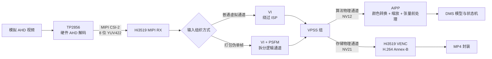
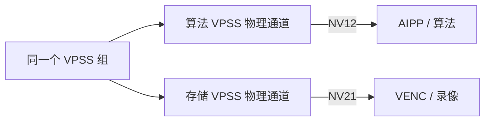
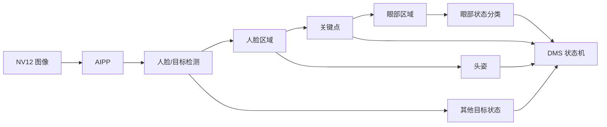

# DMS 媒体链路与算法图像接口

## 1. 结论

| 项目 | 结论 | 当前状态 |
|---|---|---|
| 算法图像格式 | **YUV420SP，即 NV12；Y 平面之后为 UV 交错平面** | `devlop-v2.0.2.x` 源码调用链已明确；板端需绑定实际 `mediad` 版本并读取运行时属性 |
| 存储编码图像格式 | **YVU420SP，即 NV21；Y 平面之后为 VU 交错平面** | 目标分支的存储 VPSS 通道配置已明确 |
| TP2856 输入 | 摄像头送入的是模拟 AHD 信号，不是 Hi3519 可见的 Bayer RAW | 媒体配置和板端驱动状态一致 |
| TP2856 输出 | MIPI CSI-2、8 位 YUV422 | MIPI RX、VI 与驱动配置一致；具体 YUV422 字节顺序仍需抓取数据核对 |
| YUV422 到 YUV420 | 由 Hi3519 的 VI、PSFM 和 VPSS 硬件链路完成；不同输入组织方式的转换位置略有差异 | 各模块目标像素格式已明确 |
| MP4 视频编码 | 存储 VPSS 的 NV21 先由 Hi3519 VENC 硬件编码为 H.264 Annex-B，再封装为 MP4 | 编码与通用 MP4 打包实现已明确 |
| MP4 是否再次编码 | 否。MP4 层只处理视频轨、SPS/PPS、NAL 长度和 sample | 通用 MP4 打包实现已明确 |

最容易混淆的是算法通道与存储通道：二者来自同一个 VPSS 组，但使用不同的物理 VPSS 通道。存储通道的 NV21 状态不能代表算法通道的实际格式。

## 2. 总体数据流



各模块之间的数据格式如下：

| 边界 | 数据格式 | 说明 |
|---|---|---|
| 摄像头 → TP2856 | 模拟 AHD | 同轴模拟高清视频信号 |
| TP2856 → MIPI RX | 8 位 YUV422 | 已完成模拟视频解码，不是 Bayer RAW |
| VI/PSFM → VPSS | YVU420SP 为主要汇合格式 | 普通 VI 通道和 PSFM 输出均配置为 YVU420SP；特殊打包路径借用 VI 的 packed-YUV 枚举承载数据 |
| VPSS → 算法 | YUV420SP / NV12 | 算法通道显式覆盖为 UV 顺序 |
| VPSS → VENC | YVU420SP / NV21 | 存储通道保持 VU 顺序 |
| VENC → 录像服务 | H.264 Annex-B | 包含 SPS、PPS、IDR、P 等 NAL 单元 |
| 录像服务 → 文件 | MP4 | H.264 视频轨，可选 G.711 A-law 音频轨 |

## 3. TP2856 输入与解码

### 3.1 输入不是 Bayer RAW

摄像头内部的图像传感器可能产生 Bayer RAW，但该数据在摄像头内部已经过处理并被编码为 AHD 模拟信号。Hi3519 板端能够看到的第一层数据是 TP2856 解码后的 YUV422，因此本项目的媒体链路不包含 Bayer 去马赛克、白平衡或常规 Sensor ISP 成像流程。

源码中的 `RawTiming`、`RGB_BAYER_16BPP` 以及带 `YUYV_PACKAGE_422` 含义的特殊枚举，用于让 VI 接口承载打包 YUV422 或伪单帧数据。它们描述传输和内存组织方式，不代表输入重新变成了 Bayer RAW。

### 3.2 驱动与媒体服务的分工

板端实际加载的模块为 `ot_tp2856`，`/proc/modules` 中的 `(O)` 表明它是独立加载的外部内核模块。用户态设备节点为 `/dev/tp2802dev`。

职责划分如下：

- 系统启动流程加载 `ot_tp2856.ko` 并创建设备节点；
- `mediad` 打开 `/dev/tp2802dev`；
- `mediad` 通过 ioctl 查询输入状态和制式；
- `mediad` 通过 ioctl 设置 HDA、720p/1080p、25/30/50/60 Hz 和 MIPI 输出模式；
- 内核驱动把模式配置转换为 TP2856 寄存器操作。

设备节点沿用 TP2802 系列 ABI，节点名不能用来判断实际芯片型号。

### 3.3 TP2856 的解码方式

TP2856 在芯片内部完成 AHD 模拟视频接收、均衡、时钟恢复、解调和数字视频输出，向 Hi3519 提供 8 位 YUV422。媒体源码能够确定输入/输出接口和工作模式，但不能还原芯片内部的专有 DSP 实现。

以下细节仍依赖 TP2856 原厂完整数据手册或寄存器说明：

- AHD 解调与均衡算法；
- 自动增益、钳位和黑电平控制；
- 亮度、色度、饱和度和色彩矩阵处理；
- 降噪、锐化及失锁重锁后的参数装载；
- MIPI YUV422 的最终 YUYV、UYVY、YVYU 或 VYUY 字节顺序。

## 4. Hi3519 接收与 YUV420 转换

### 4.1 MIPI RX 与 VI

MIPI RX 配置为 YUV422 输入，VI 配置为 ISP bypass。当前代码存在三种输入组织方式：

| 路径 | MIPI/VI 组织方式 | VPSS 前的输出 |
|---|---|---|
| 普通四路输入 | MIPI YUV422 虚拟通道，VI 使用 YUV timing | VI 通道输出 YVU420SP |
| 打包 YUV422 输入 | VI 使用 packed-YUV 相关枚举承载 | VI 通道按目标属性输出 YVU420SP |
| 伪单帧复用输入 | 带通道头和可变行的 packed YUV422 | PSFM 拆分后输出 YVU420SP |

YUV422→YUV420 的本质是垂直方向色度降采样：每两个垂直像素行共享一组色度样本。该过程由 Hi3519 媒体硬件完成，不是 CPU 软件逐像素转换。

### 4.2 PSFM 的作用

PSFM 只用于伪单帧复用输入。它读取帧中的通道头和行信息，将一个复用输入恢复为多个逻辑视频通道，并把每个通道以 YVU420SP 送入对应 VPSS 组。普通虚拟通道输入不经过 PSFM。

PSFM 的职责是拆分复用通道，不是算法前处理模块。

## 5. VPSS 分流与算法图像格式

### 5.1 算法和存储是独立通道



两个通道分别设置分辨率、帧率、缩放方式、像素格式和压缩模式。不存在“先进入 VENC，再从录像流取图给算法”的关系。

### 5.2 算法通道格式：NV12

算法 YUV 共享管线的创建顺序为：

1. 从 VPSS 组申请普通物理通道；
2. 设置算法输入尺寸和帧率；
3. 启用双线性缩放；
4. 准备通道属性时，默认像素格式为 `YVU_SEMIPLANAR_420`；
5. 双线性分支将目标像素格式覆盖为 `YUV_SEMIPLANAR_420`；
6. 调用 VPSS 设置通道属性；
7. 设置失败时，管线创建返回错误，不继续启动算法共享通道。

因此，目标分支中的算法通道目标格式是 NV12，而不是把 NV21 缓冲区简单改名。双线性缩放负责插值，`pixel_format` 属性负责指定输出的 UV/VU 排列；两项设置在同一分支中完成，但含义不同。

### 5.3 存储通道格式：NV21

VENC 存储管线独立申请 VPSS 物理通道，没有启用算法管线的双线性格式覆盖，因此沿用默认 `YVU_SEMIPLANAR_420`，即 NV21。

### 5.4 压缩模式与线性内存

像素格式与内存压缩是两个不同属性。当前物理 VPSS 通道 0/1 可能默认使用分段压缩，高编号通道则使用非压缩模式；算法侧存在按 `stride × height × 3/2` 使用连续内存的实现。

板端应记录以下运行参数：

- VPSS 组号和通道号；
- `pixel_format`；
- `compress_mode`；
- `video_format`；
- 宽、高和两个平面的 stride；
- 物理地址、共享内存句柄及缓存同步方式。

只有 `pixel_format=NV12` 且缓冲区为可线性访问的非压缩布局时，才能直接按 NV12 读取。

## 6. AIPP 与 DMS 算法

算法从共享媒体接口取得 NV12 图像后，由 AIPP 完成以下处理：

- NV12 到 RGB 或 BGR 的颜色空间转换；
- 图像裁剪与缩放；
- 通道顺序调整；
- 模型需要的归一化、量化或数据布局转换。

需要与训练侧保持一致的参数包括：

| 类别 | 参数 |
|---|---|
| 颜色 | NV12/NV21、BT.601/BT.709、Full/Limited range、RGB/BGR 顺序 |
| 几何 | 原始有效区域、裁剪、缩放尺寸、宽高比、插值和 padding |
| 张量 | NCHW/NHWC、数据类型、scale、mean/std、量化参数 |
| 图像状态 | mirror、flip、stride、压缩模式和缓存同步 |

`rbuv_swap_switch` 等开关只能在输入字节顺序和 AIPP 输出张量得到核对后调整，不能依据 VENC 通道显示的 NV21 状态修改算法配置。

DMS 的图像依赖顺序为：



上游图像格式、缩放或检测框发生变化时，会继续影响关键点、人脸区域、眼部裁剪和最终报警状态。

## 7. H.264 编码与 MP4 存储

### 7.1 视频编码

存储管线的数据流为：

```text
VPSS NV21
→ Hi3519 VENC
→ H.264 Annex-B
→ 共享编码流
→ MP4 打包器
```

目标分支的流配置解析固定选择 H.264，VENC 创建为 H.264 类型。分辨率、帧率、码率控制、GOP 和 profile 由媒体配置传入。编码工作由 Hi3519 VENC 硬件完成，输出包含 SPS、PPS、IDR、P 等 NAL 单元的 Annex-B 码流。

### 7.2 MP4 封装

通用 MP4 打包器执行以下操作：

1. 创建 MP4 文件；
2. 等待第一个包含 SPS 的 I 帧；
3. 根据分辨率、帧率和 SPS 信息创建 H.264 视频轨；
4. 从关键帧中提取并登记 SPS、PPS；
5. 取出 IDR 或 P 帧 NAL 单元；
6. 将 Annex-B 四字节起始码位置改写为大端 NAL 长度；
7. 将 NAL 写为 MP4 sample；
8. 可选添加 8 kHz、G.711 A-law、单声道音频轨。

MP4 封装阶段不执行第二次视频编码。H.264 是压缩编码格式，MP4 是容器格式。

当前代码能够说明媒体库的编码与封装方式；报警录像的预录缓存、文件分片、报警文件保护和索引策略由上层录像服务决定，尚未在本链路中闭合。

## 8. MP4 回放与视频注入

当前 OpenCV 启用了 FFmpeg，`VideoCapture` 读取 MP4 时通常执行：

```text
MP4 解封装
→ H.264 软件解码
→ YUV 到 BGR 转换
→ OpenCV BGR Mat
```

这与实时算法链路不同：

```text
实时：TP2856 → VI/PSFM → VPSS NV12 → AIPP → 模型
回放：MP4 → FFmpeg → OpenCV BGR → OpenCV/算法前处理 → 模型
```

| 回放方式 | 用途 | 主要差异 |
|---|---|---|
| OpenCV BGR 直接推理 | 快速复现检测和报警逻辑 | 绕过 NV12→AIPP 的颜色转换，并引入 H.264 有损压缩 |
| FFmpeg 解码后转换一次为 NV12，再走原 AIPP | 对齐板端前处理 | 仍保留录像编码损失，但减少 OpenCV 颜色转换差异 |
| HDMI/AHD 整机注入 | 验证完整硬件链路 | 额外经过播放器、GPU、HDMI、转换盒和模拟 AHD 链路 |

重新编码生成的 MP4 可以用于功能注入测试，但不能作为实时算法输入的逐像素基准。播放器输出的矩阵、range、分辨率、刷新率、缩放和 HDMI/AHD 转换参数必须固定。

## 9. TP2856 亮度寄存器实测

板端对两颗 TP2856、每颗四个 decoder page 读取了五个图像控制寄存器，八路结果一致：

| 参数 | 运行时读值 |
|---|---|
| brightness | `0x00` |
| contrast | `0x40` |
| saturation | `0x40` |
| hue | `0x00` |
| sharpness | `0x00` |

该次快照未发现某一路静态图像参数与其他通道不同。初始化表中出现过另一组候选值，说明运行阶段存在后续覆盖，初始化值不能代表最终状态。

亮度突变问题仍需在同一输入条件下保存正常画面和异常画面的成对记录，同时读取：

- 上述五个图像控制寄存器；
- decoder lock、制式和重锁状态；
- AGC、增益、钳位和黑电平状态；
- VI 与算法 VPSS 的 Y/U/V 统计；
- PTS、温度、供电和输入源状态。

若五个寄存器保持不变，应把排查重点转向 AGC、增益、钳位、黑电平、失锁重锁以及摄像头照明/光学链路。

## 10. 版本与待核查项

### 10.1 适用版本

- 媒体源码分支：`devlop-v2.0.2.x`；
- 板端实际驱动模块：`ot_tp2856`；
- 用户态控制节点：`/dev/tp2802dev`；
- 参考材料：《DMS 输入图像对齐》《DSM - 媒体视频流 pipeline 核查》；
- MP4 回放入口：启用 FFmpeg 的 OpenCV。

板端 `ot_tp2856.ko` 与早期分析使用的 `hi_tp2856.ko` 文件摘要不同，后者只能作为同系列驱动结构参考。板端模块参数与目标分支部分枚举值也曾出现不一致，因此运行结果必须同时记录固件、驱动、`mediad` 和配置版本。

### 10.2 待核查项

1. 板端运行的 `mediad` 是否确由 `devlop-v2.0.2.x` 对应构建产生；
2. 算法实际 VPSS 组/通道的 `pixel_format`、压缩模式和 stride；
3. 已知色条下的 UV/VU 字节顺序；
4. MIPI/VI 边界的 YUV422 具体字节顺序；
5. AIPP 的颜色矩阵、range、通道顺序、缩放与归一化参数；
6. 报警录像服务对预录、分片、文件保护和索引的处理；
7. TP2856 正常/亮度突变时的成对寄存器和状态记录。
