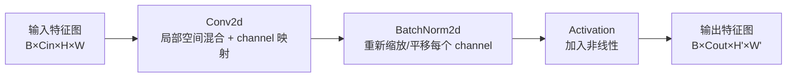
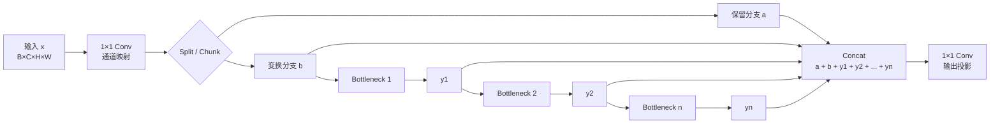
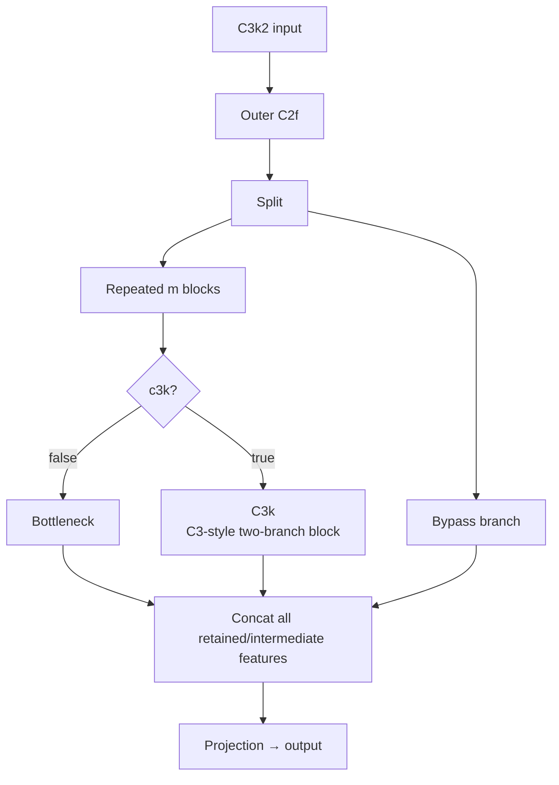
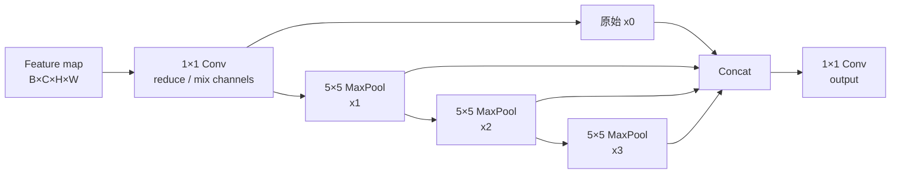
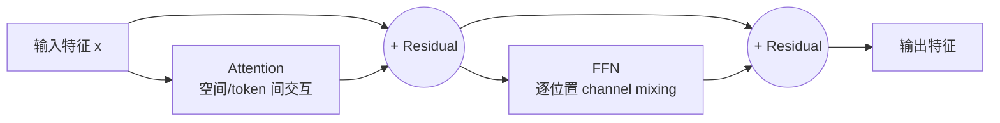
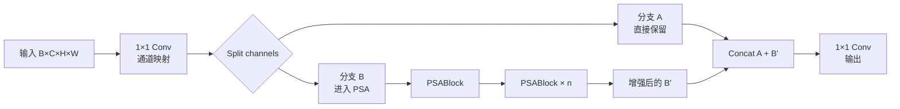
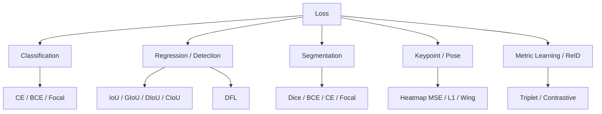

# Architecture

本页以 Ultralytics YOLO11 的固定实现 `b89d6f407` 为深入理解锚点，再用其他分支解释机制变化。固定 revision 很重要：配置段名、模块实现和导出路径会随 release 改变（Y019）。

YOLO26 的完整逐层结构不在本页重复维护；见 [YOLO26 architecture and modification map](yolo26-architecture.md)。本页只保留跨分支机制变化和 YOLO11 锚点。

## 1. 先看完整数据流

```text
image
→ preprocessing
→ stem / backbone: P1/2 → P2/4 → P3/8 → P4/16 → P5/32
→ SPPF + C2PSA
→ top-down fusion: P5 → P4 → P3
→ bottom-up fusion: P3 → P4 → P5
→ Detect(P3, P4, P5)
→ box distributions + class logits
→ DFL / decode / score handling
→ NMS or end-to-end selection
```

`preprocessing`、标签分配、损失、decode 和 NMS 不都属于网络层，但它们共同决定最终结果。排查时必须先确认差异位于哪一段。

## 2. YOLO11 P3–P5 参考图

下面的节点编号来自固定的官方 `yolo11.yaml`，用于说明拓扑，不保证其他 package revision 保持相同编号（Y019）。

| 阶段 | 参考节点 | 空间尺度 | 主要作用 | 先观察什么 |
|---|---:|---:|---|---|
| 输入 | 网络外 | `H×W` | 颜色、range、resize、padding、layout | 实际送入模型的 tensor 是否一致 |
| Stem / P1–P2 | 0–2 | `1/2`、`1/4` | 早期下采样和局部特征形成 | 小目标是否在早期已失去有效像素；padding 是否产生位移 |
| P3 backbone | 3–4 | `1/8` | 保留较高空间分辨率，服务小目标 | 纹理和边缘响应、目标区域与背景是否可分 |
| P4 backbone | 5–6 | `1/16` | 中等尺度表征 | 目标语义是否形成、定位是否仍稳定 |
| P5 backbone | 7–10 | `1/32` | 深层语义、SPPF 聚合和 C2PSA | 深层表征、注意力与目标 runtime 支持 |
| Top-down fusion | 11–16 | `1/16 → 1/8` | 上采样深层语义并与 P4/P3 拼接 | 上采样尺寸、concat 输入和 channel 顺序 |
| Bottom-up fusion | 17–22 | `1/8 → 1/32` | 把浅层定位信息重新聚合到 P4/P5 | 下采样后的空间对齐和融合输出 |
| Detect | 23 | P3/P4/P5 | 每个尺度分别产生回归分布和类别 logits | 三个输入顺序、shape、stride 和输出语义 |

对 640×640 输入，P3/P4/P5 的空间尺寸通常是 80×80、40×40、20×20；对 224×224 输入则是 28×28、14×14、7×7。它只说明候选位置密度，不保证小目标一定得到有效监督或正确预测。

## 3. 各模块到底做什么

### Conv 下采样

YOLO11 使用 stride-2 convolution 逐级降低空间分辨率并增加通道。它扩大有效感受野并降低后续计算，但也会把局部目标压缩到更少位置。小目标在 P3 之前已不可分时，增加更深层容量通常无法恢复原始像素信息。

排查重点：kernel、stride、padding、输入奇偶尺寸、导出后的 padding 语义，以及目标经过每次下采样后的有效像素。

### C3k2 与 CSP 类路径

固定实现中的 C3k2 继承 C2f 的分流—变换—拼接结构，并可在内部选择 C3k block。它的意义是组织特征复用和梯度路径，不是一个可以脱离宽度、深度、shortcut 和具体实现单独排名的名称。

排查重点：输入输出 channel、隐藏通道缩放、分支 concat 顺序、shortcut、模型 scale，以及转换器是否保持相同拓扑。

### SPPF

SPPF 在不继续降低空间尺寸的情况下串行使用相同 max-pooling 聚合不同范围的上下文，再拼接输出。它改变的是深层特征的上下文范围，不会恢复已丢失的高分辨率细节。

排查重点：pool kernel、padding、concat 顺序和目标后端对 pooling 的实现。

### C2PSA

固定 YOLO11 实现先把通道分成两部分，只对其中一部分堆叠 PSABlock，再拼接投影。PSABlock 包含 attention、前馈网络和残差路径。它为深层特征增加较长距离的空间交互，同时引入 attention reshape、矩阵运算和更高的部署敏感性。

排查重点：输入 shape、head 数、reshape/transpose、attention 数值范围、算子融合和 INT8 支持；不能把模块名称直接等同于目标硬件收益。

### Top-down 与 bottom-up feature fusion

官方 YAML 把融合层与最终 Detect 都放在 `head:` 配置段中，但按功能划分，Upsample、Concat、C3k2 和 stride-2 Conv 组成 neck，只有最终 Detect 承担 detection head。配置段名不能替代模块职责判断。

Top-down 路径把 P5 语义送回 P4/P3；bottom-up 路径再把融合后的浅层信息聚合到 P4/P5。融合要求空间尺寸、channel 和来源节点同时正确。只要上采样、padding、concat 顺序或节点选择不同，最终框可能变化，即使单个卷积实现本身正确。

### Detect、DFL 与 decode

固定实现对 P3/P4/P5 各设回归分支和分类分支。回归侧输出四个方向的离散分布，`reg_max=16`；分类侧输出每类 logits。训练时三层 raw tensor 直接交给损失；推理时各尺度被展平拼接，DFL 把分布积分为距离，再结合 anchor points 和 stride 解码为框，分类 logits 经 sigmoid 得到分数（Y019）。

YOLO11 默认不是仅靠一个 `objectness` 数值解释全部置信度。导出图是否包含 decode 或 NMS 取决于 exporter 与参数；必须查看真实输出，不能仅凭文件名判断。

## 4. 训练路径与推理路径不是同一张语义图

```text
训练：raw P3/P4/P5 → anchor points → 标签分配 → box / cls / DFL loss
推理：raw P3/P4/P5 → DFL → decode → score → NMS / result selection
```

训练 loss 正常不证明推理 decode 正确；最终框一致也可能掩盖 raw tensor 的系统偏移。标签分配和损失见 [Data and training](data-and-training.md)，输出与 runtime 契约见 [Deployment](deployment.md)。

## 5. 跨分支只保留机制变化

| 机制变化 | 代表分支 | 真正改变什么 | 不能直接推出什么 | Source |
|---|---|---|---|---|
| 单次整图预测 | YOLOv1 | 把检测组织为单次前向回归 | 现代分支仍使用相同网格与损失 | Y001 |
| anchor 与多尺度预测 | YOLOv2 / YOLOv3 | 候选尺度、解码和多层输出 | 任意数据都适合原 anchor | Y002–Y003 |
| CSP/ELAN 类路径与多尺度融合 | YOLOv4、YOLOv5、YOLOv7 等 | 特征与梯度路径、neck 组织 | 同名模块跨仓库完全相同 | Y004、Y007、Y011 |
| anchor-free、解耦 head、动态分配 | YOLOX、PP-YOLOE、YOLOv8 等 | 候选定义、分类/定位路径和正样本选择 | 不再需要坐标形式和标签分配 | Y008–Y009、Y012 |
| 结构重参数化 | YOLOv6、YOLOv7 | 训练图与推理图发生变换 | 转换器已正确完成融合 | Y010–Y011 |
| one-to-one / NMS-free | YOLOv10、YOLO26 | 训练匹配和结果选择 | 任意导出图都无需外部 NMS | Y017、Y023 |
| 开放词汇与提示 | YOLO-World、YOLOE | 类别表示和运行时依赖 | 权重、词表和提示可跨实现混用 | Y018、Y021 |

完整分支身份只在 [Variants and implementations](variants.md) 维护。

## 6. 看一个具体权重时

至少锁定：仓库 revision、配置、scale、权重哈希、输入预处理、P3/P4/P5 节点、stride、输出 tensor、坐标格式、训练专用模块是否已融合，以及 decode/NMS 位于模型内还是模型外。开放词汇模型还要确认文本编码器或词汇嵌入是否仍在运行时图中。

## 7. 基础模块最低掌握线

这一节采用统一的六层解释法：**现实问题 → 图形化结构 → tensor 流 → 数学公式 → 为什么这样设计 → YOLO/部署影响**。模型结构优先使用 Mermaid 图；如果结构复杂到 Mermaid 会降低可读性，应继续用表格、ASCII 图或单独 SVG，而不是为了“有图”牺牲逻辑清晰度。

### 7.1 Conv → BatchNorm → Activation

固定 YOLO11 `Conv` 的默认路径是 `Conv2d(bias=False) → BatchNorm2d → SiLU`（Y019）。先把它看成三件事：



#### 7.1.1 Conv 到底做了什么

对一个输出 channel：

$$
z_{o,i,j}=\sum_c\sum_{u,v}W_{o,c,u,v}x_{c,i+u,j+v}+b_o$$

直观上，`3×3` Conv 在每个位置拿一个局部窗口，把窗口中的像素/特征按权重相加。多个输出 channel 就相当于同时学习多种局部模式，例如边缘、纹理、角点、局部形状。

stride=2 时，窗口不是每个像素都计算，而是隔一个位置取一次，因此空间尺寸下降。对于小目标，这意味着目标的有效像素会越来越少，所以“增加网络深度”不能自动弥补早期下采样造成的信息损失。

#### 7.1.2 BatchNorm：γ、β从哪里来

训练时，对一个 channel 的 mini-batch 激活计算：

$$
\mu_B=\frac{1}{m}\sum_{k=1}^{m}x_k,\qquad
\sigma_B^2=\frac{1}{m}\sum_{k=1}^{m}(x_k-\mu_B)^2
$$

标准化：

$$
\hat{x}=\frac{x-\mu_B}{\sqrt{\sigma_B^2+\epsilon}}
$$

再由两个**可学习参数**恢复可调尺度和偏移：

$$
y=\gamma\hat{x}+\beta
$$

关键点：

- `γ` 和 `β` 不是根据当前输入手工计算的；它们属于模型参数。
- 常见初始化是 `γ=1`、`β=0`，使 BN 初始时近似只做标准化。
- 训练时通过反向传播和 optimizer（SGD/Adam 等）更新 `γ, β`。
- `running_mean`、`running_var` 是另一组统计状态；它们不是 γ、β。
- 推理时通常不再使用当前 batch 的统计量，而使用训练阶段累计的 running statistics。

因此可以把 BN 理解成：

```text
原始激活
   ↓
“先把尺度/偏移拉回一个稳定范围”
   ↓
标准化 x_hat
   ↓
“但网络仍然需要自由选择最终尺度和偏移”
   ↓
γ × x_hat + β
   ↓
输出
```

如果去掉 γ、β，BN 就强制每个 channel 的输出保持固定标准化形式，表达能力会受到限制。γ、β让网络可以学习“保留多少标准化效果”。

#### 7.1.3 推理阶段为什么 BN 可以消失

如果卷积 bias 为 0，推理阶段 BN 可以折叠进 Conv：

$$
W'=\frac{\gamma}{\sqrt{\sigma^2+\epsilon}}W
$$

$$
b'=\beta-\frac{\gamma\mu}{\sqrt{\sigma^2+\epsilon}}
$$

因此：

```text
训练图：Conv → BN

推理图：Conv'

两者可以在固定 running statistics 下数学等价
```

这也是为什么部署优化经常把 `Conv+BN` 融合成一个卷积。

#### 7.1.4 SiLU 以及常见激活函数

SiLU：

$$
SiLU(x)=x\sigma(x)=\frac{x}{1+e^{-x}}
$$

它在负区间不是简单截断，而是平滑地衰减；在现代 CNN/YOLO 中很常见。

常见激活函数至少应能认出下面这些：

| 激活 | 公式 | 常见使用位置 | 特殊点 |
|---|---|---|---|
| ReLU | `max(0,x)` | 经典 CNN、轻量 CNN | 简单、快；负值梯度为 0 |
| LeakyReLU | `max(x, αx)` | 检测/生成网络、部分旧架构 | 负半轴保留固定斜率 |
| PReLU | `max(x, αx)` | 一些 CNN | α 是可学习参数 |
| ELU | `x` if `x>0`, else `α(e^x-1)` | 部分 CNN | 负值平滑 |
| GELU | `xΦ(x)` | Transformer、ViT、MLP | 概率式平滑门控，现代 Transformer 常见 |
| SiLU/Swish | `xσ(x)` | YOLO 等现代 CNN | 平滑、非单纯截断 |
| Mish | `x tanh(softplus(x))` | 部分检测网络 | 平滑但计算相对复杂 |
| Softplus | `log(1+e^x)` | 少数需要平滑正值映射的模块 | ReLU 的平滑版本 |
| Sigmoid | `1/(1+e^-x)` | 二分类、多标签、YOLO 类别输出 | 输出 0–1；不是中间层首选激活 |
| Softmax | `exp(x_i)/Σ_j exp(x_j)` | 多分类、Attention、DFL | 在类别/bin 维度归一化成概率分布 |

特别要记住“同一个函数在不同位置承担不同任务”：

```text
CNN 中间层       Conv → BN → SiLU
YOLO 分类输出    logits → Sigmoid
Attention 权重   QK^T → Softmax
DFL 分布         bin logits → Softmax
```

不能因为它们都叫“activation”就认为作用相同。Sigmoid/Softmax 常常承担概率或权重归一化，而 SiLU/ReLU/GELU 更多承担中间特征的非线性变换。

### 7.2 C2f：为什么要“分流，再逐级变换，再全部拼起来”

C2f 最容易被误解成“多个 Bottleneck 串起来”。真正的结构是：**部分特征直接保留，另一部分逐级变换，而且每一级中间结果都进入最终 concat。**



用具体数字理解更直观。假设输入 `80×80×128`，隐藏通道 `c=64`，内部有 `n=2` 个 block：

```text
80×80×128
      ↓ 1×1 Conv
80×80×128
      ↓ split
 ┌──────────────┬──────────────┐
 │ a: 64 ch     │ b: 64 ch     │
 │ 直接保留      │ 进入变换      │
 └──────────────┴──────┬───────┘
                       ↓
                 Bottleneck
                       ↓ y1: 64 ch
                 Bottleneck
                       ↓ y2: 64 ch

最终：a + b + y1 + y2
      64 + 64 + 64 + 64
      = 256 channels
             ↓
          1×1 Conv
             ↓
        80×80×128
```

所以 C2f 的核心不是“多做几次卷积”，而是**保留更多中间表示并建立多条梯度路径**。普通串行结构更像：

```text
x → B1 → B2 → B3 → output
```

C2f 更像：

```text
x → split ────────────────┐
      └→ B1 → y1 ────────┤
             └→ B2 → y2 ─┤→ concat → output
```

这也是读源码时应该关注 `chunk/split`、`ModuleList`、`cat` 的原因。

### 7.3 C3k2：C2f 外壳 + 可替换内部 block



固定 YOLO11 实现中，`C3k2` 继承 `C2f`，所以先理解 C2f 再理解 C3k2。`c3k=False` 时内部通常走 Bottleneck；`c3k=True` 时可进入 C3k。具体 kernel、shortcut、`n`、width/depth scaling 必须以固定 revision 和 YAML 实参为准。

因此不能从“C3k2”这个名字直接推断计算量。真正决定计算的是：输入输出 channel、隐藏 channel、block 数、kernel、shortcut、是否 C3k、模型 scale。

### 7.4 SPPF：为什么连续三个 5×5 pooling 可以看到不同范围



对于 stride=1、same padding：

```text
x0：当前点本身的局部表示
x1：约 5×5 范围的信息
x2：约 9×9 范围的信息
x3：约 13×13 范围的信息
```

原因可以从一维长度直观看：连续两个 `5` 的有效范围是 `5+4=9`，再来一次是 `9+4=13`。二维情况同理。

因此 SPPF 做的是**在不降低当前 feature map 空间分辨率的前提下，引入更大上下文**。它不能把已经在 P2/P3 下采样阶段丢失的小目标细节“变回来”。

### 7.5 Attention：视觉中的“当前位置应该看谁”

先不要从公式开始。把 feature map 想象成一张低分辨率语义图：

```text
Feature map B×C×H×W

┌────┬────┬────┬────┐
│ p1 │ p2 │ p3 │ p4 │
├────┼────┼────┼────┤
│ p5 │ p6 │ p7 │ p8 │   每个位置都有一个 C 维特征
├────┼────┼────┼────┤
│... │... │... │... │
└────┴────┴────┴────┘
```

卷积天然偏向局部邻域：一个位置主要从附近的 kernel window 获得信息。Attention 改成动态询问：

> “当前位置 i，需要从其他哪些位置 j 获取信息？”

视觉上可以想成：

```text
        眼睛区域
           ↓
     ┌─────────────┐
     │ 另一只眼睛  │ ← 可能有帮助
     │ 鼻梁        │ ← 可能有帮助
     │ 眼眶边缘    │ ← 可能有帮助
     │ 背景区域    │ ← 可能没有帮助
     └─────────────┘
```

这就是 long-range dependency：远处位置也可以直接参与当前位置的表示更新。

#### 7.5.1 从 feature map 到 token

令 `N=H×W`。把二维位置摊平：

```text
B×C×H×W
      ↓ flatten spatial dimensions
B×C×N
      ↓
每一个空间位置 = 一个 token
      ↓
Q、K、V
```

对一个 head，若 token 维度为 `d`，可以把每个位置想成三种描述：

- Q：我现在想找什么信息？
- K：我这里有什么信息可被匹配？
- V：如果你关注我，我真正提供什么内容？

相关性来自 Q 与 K 的内积：

$$
s_{ij}=\frac{q_i^T k_j}{\sqrt{d}}
$$

它回答的是：**位置 i 对位置 j 有多感兴趣？**

再在 j 这个维度做 softmax：

$$
a_{ij}=\frac{e^{s_{ij}}}{\sum_j e^{s_{ij}}}
$$

于是每个位置 i 得到一组权重：

```text
              被关注的位置 j
          p1   p2   p3   p4 ...
位置 i    0.1  0.1  0.6  0.2 ...
                 ↑
             最关注 p3
```

最后用这些权重对 V 加权求和：

$$
y_i=\sum_j a_{ij}v_j
$$

这句话是视觉 Attention 最值得真正理解的一句：

> **一个位置的新特征，是所有位置特征的加权组合；权重由当前内容动态决定。**

#### 7.5.2 为什么是 Q/K/V 三个东西

如果只有一个向量，很难同时表达“我要找什么”和“我能提供什么”。Q/K/V 把匹配和信息传递拆开：

```text
当前位置 i
   │
   └─ Q_i：我要找什么？ ──────┐
                              │ compare
其他位置 j                    ↓
   └─ K_j：我是什么？ ───────→ score(i,j)
                              │
                              ↓ softmax
                         attention weight
                              │
其他位置 j                    ↓
   └─ V_j：我真正提供什么？ → weighted sum
```

固定 YOLO11 Attention 使用 `1×1 Conv` 生成 Q/K/V，并做 multi-head reshape；同时在 value 路径加入 depthwise `3×3` positional encoding，再经过 projection（Y019）。

#### 7.5.3 为什么 Attention 通常放深层

Attention 的核心交互矩阵尺寸与 `N=H×W` 有关，成本大致随 `N²` 增长：

```text
P2: H、W 大 → N 大 → N² 极大
P3: 仍然较大
P4: 明显降低
P5: 最低
```

所以把 Attention 放到低分辨率深层 feature map，是一个典型的计算/全局建模折中。它不是“Attention 只能放深层”，而是**深层语义更成熟、token 更少，通常更适合承受全局交互成本**。

### 7.6 PSABlock：把 Attention + FFN 变成一个完整处理单元

PSABlock 可以用 Transformer block 的直觉理解，但必须以固定 YOLO11 实现为准：



对应固定实现的简化表达：

$$
x_1=x+Attention(x)
$$

$$
x_2=x_1+FFN(x_1)
$$

这里三者的现实含义不同：

| 部件 | 它在问什么 | 视觉意义 |
|---|---|---|
| Attention | “我应该参考哪些其他位置？” | 跨眼睛、跨轮廓、跨物体区域交换上下文 |
| FFN | “我拿到这些信息后，如何重新组合 channel？” | 对每个位置的语义特征做非线性变换 |
| Residual | “原来的信息要不要直接保留？” | 防止每层都必须重新构造完整特征，改善优化与信息传递 |

以 DMS 为例，一个眼睛小目标的局部纹理可能很弱，但脸部结构、另一只眼睛、眼眶和鼻梁可以提供上下文。Attention 可以让该位置动态参考这些区域；FFN 再对融合后的 channel 表示进行变换。**它不是凭空创造像素细节，而是在已有 feature 中重新组织上下文关系。**

固定实现的 FFN 可理解为：

```text
C channels
   ↓ 1×1 Conv
2C channels
   ↓ activation
2C channels
   ↓ 1×1 Conv
C channels
```

因此 Attention 更偏“位置之间交换信息”，FFN 更偏“单个位置内部的通道变换”。

### 7.7 C2PSA：为什么不是所有 channel 都做 Attention

C2PSA 可以看成“CSP 思想 + PSA/Attention”。



为什么这样做？因为 Attention 是昂贵的。假设输入有 `C` 个 channel，把全部 channel 都交给 PSA 会让整个深层特征都承担 attention 的计算和内存开销。C2PSA 只让部分 channel 进入 PSA，另一部分走 bypass：

```text
全部特征
  ├──────────────→ 原始/低成本路径
  │
  └──────────────→ Attention / PSA 路径
                         ↓
                 全局上下文增强
                         ↓
                    Concat
```

这是一种**表达能力与计算量之间的结构折中**。因此修改 split 比例时，不仅会改变参数/FLOPs，还会改变“有多少 feature channel 能直接获得全局交互”。

### 7.8 DFL 只是 YOLO 检测 Loss 中的一种

必须先把 Loss 放回完整视觉任务体系，而不是把“DFL”误认为“YOLO 的全部 loss”：



对 YOLO11，核心检测监督可以抽象成：

```text
Detect raw outputs
       │
       ├── class logits ─────→ BCE
       │
       ├── box geometry ─────→ CIoU-style box loss
       │
       └── 4 × distance bins → DFL
```

固定 YOLO11 `reg_max=16`。对一个边界距离 `y`，模型预测 `K` 个离散 bins 的 logits `z_i`：

$$
p_i=\frac{e^{z_i}}{\sum_{j=0}^{K-1}e^{z_j}}
$$

训练时令：

$$
l=\lfloor y\rfloor,\qquad r=l+1
$$

$$
w_l=r-y,\qquad w_r=y-l
$$

然后用两个相邻 bin 的加权交叉熵监督：

$$
L_{DFL}=w_l CE(z,l)+w_r CE(z,r)
$$

推理时用分布期望恢复连续距离：

$$
\hat d=\sum_{i=0}^{K-1}i p_i
$$

所以必须区分：

```text
DFL representation / expectation
        ↓
推理时把离散分布变成连续距离

DFL loss
        ↓
训练时监督这个离散分布
```

两者相关，但不是同一个算子。

#### 7.8.1 目标检测之外还必须掌握哪些 Loss

**分类：**

交叉熵：

$$
p_j=\frac{e^{z_j}}{\sum_k e^{z_k}},\qquad L=-\log p_y
$$

BCE：

$$
L=-[y\log p+(1-y)\log(1-p)],\qquad p=\sigma(z)
$$

Focal：

$$
L=-\alpha_t(1-p_t)^\gamma\log(p_t)
$$

**回归：**

MSE：

$$
L=\frac{1}{n}\sum_i(x_i-y_i)^2
$$

MAE：

$$
L=\frac{1}{n}\sum_i|x_i-y_i|
$$

Smooth L1：

$$
L=\begin{cases}
\frac{1}{2}d^2/\beta,& |d|<\beta\\
|d|-\frac{1}{2}\beta,& |d|\ge\beta
\end{cases}
$$

其中 `d = prediction - target`。它在小误差区近似 L2、大误差区近似 L1，因此常用于更稳健的回归。

**检测框：**

$$
IoU=\frac{|B_p\cap B_g|}{|B_p\cup B_g|}
$$

$$
GIoU=IoU-\frac{|C\setminus(B_p\cup B_g)|}{|C|}
$$

$$
DIoU=IoU-\frac{\rho^2}{c^2}
$$

CIoU 在 DIoU 基础上再加入宽高比项，因此可以分别理解为：

```text
IoU   → 有没有重叠
GIoU  → 没重叠时，闭包区域还能提供什么方向
DIoU  → 中心点应该靠近
CIoU  → 中心 + 宽高比例也应该一致
```

**分割：**

Dice：

$$
Dice=\frac{2|P\cap G|}{|P|+|G|}
$$

常用 Dice loss：

$$
L_{Dice}=1-Dice
$$

它直接关注预测区域与真实区域的重叠，在前景很小、类别极不平衡的分割任务中尤其常见。

**关键点：**

Heatmap 方案常见 MSE：模型预测每个关键点的热图，与 Gaussian target heatmap 做逐像素误差。回归式关键点则可能使用 L1、Smooth L1、Wing Loss 等。关键点任务还经常需要 visibility/occlusion 监督。

**ReID / metric learning：**

Contrastive Loss 的思想是：相似样本拉近，不相似样本推远；Triplet Loss 使用 anchor、positive、negative：

$$
L=\max(0,d(a,p)-d(a,n)+m)
$$

其中 `m` 是 margin。

#### 7.8.2 YOLO Loss 不能只看总 loss

即使总 loss：

$$
L=\lambda_{box}L_{box}+\lambda_{cls}L_{cls}+\lambda_{dfl}L_{dfl}
$$

下降，也不能直接推出小目标 AP、召回率或部署精度提高。实际分析至少要拆：

```text
Total loss
├── box loss
│   ├── IoU / CIoU behavior
│   └── localization error
├── cls loss
│   ├── class imbalance
│   └── hard negatives
└── DFL
    ├── distance distribution
    └── decode error
```

因此读一个新检测器时，第一反应不应该是“它用了什么 loss 名称”，而应该问：**预测量是什么、target 是什么、正样本是谁、loss 惩罚什么、梯度会把哪个预测往哪里推。**

## 8. 最低自检：必须能脱稿解释

### 结构

1. Conv 为什么常见 `bias=False → BN`？BN 的 γ、β 怎么来的？推理时为什么可以 fuse？
2. 至少画出 C2f 的 split → chain → concat，并解释它与普通串行 Bottleneck 的区别。
3. C3k2 的外壳是什么？什么时候内部使用 C3k，什么时候使用 Bottleneck？
4. SPPF 为什么连续三个 `5×5` pooling 对应约 `5/9/13` 的有效范围？
5. 不看公式解释 Attention：Q、K、V 分别像什么？`QK^T` 在问什么？Softmax 后的权重代表什么？
6. 为什么视觉 Attention 的计算会对 `H×W` 敏感？为什么深层 feature map 更适合承担它？
7. PSABlock 中 Attention、FFN、Residual 在现实视觉问题里分别解决什么？
8. C2PSA 为什么只让部分 channel 进入 PSA？这会同时改变什么表达能力和部署成本？

### 激活函数

9. 写出 ReLU、LeakyReLU、PReLU、GELU、SiLU、Mish、Sigmoid、Softmax 的基本公式，并说出至少一个典型使用位置。
10. 为什么 YOLO 中间层可以用 SiLU，而分类 logits 通常用 Sigmoid，Attention/DFL 又需要 Softmax？

### Loss

11. CE 与 BCE 的根本区别是什么？为什么 YOLO 分类通常使用 BCE 类监督而不是 softmax CE？
12. Focal Loss 解决什么样的样本不平衡？γ 改变了什么？
13. IoU、GIoU、DIoU、CIoU 分别补了什么几何信息？
14. DFL 为什么要把连续距离变成相邻 bin 的分布？训练和推理分别发生什么？
15. 除检测外，能否解释 Dice、Heatmap MSE、Wing、Triplet 的 target、误差和用途？

如果只能回答“C2PSA 是注意力”“SPPF 扩大感受野”“DFL 提高定位精度”，仍然没有达到本页定义的掌握线。
