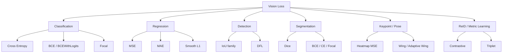
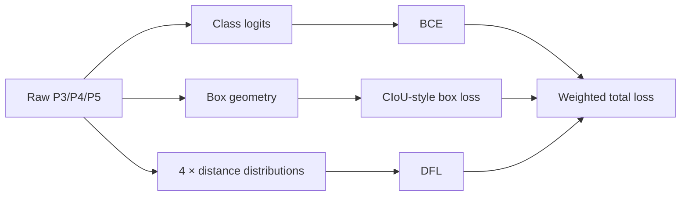

# Data and training

本页不收集所有分支的训练配方，只解释自有数据如何经过输入、标签分配和损失影响 YOLO 结果。具体命令、配置和实验输出进入工程案例。

## 1. 训练因果链

```text
图像与框标注
→ resize / crop / augmentation
→ backbone + neck
→ Detect 的 P3/P4/P5 raw outputs
→ anchor points 与候选位置
→ 标签分配
→ classification / box / DFL loss
→ 梯度更新
```

固定 YOLO11 revision `b89d6f407` 使用 TaskAlignedAssigner，为候选位置生成目标分数和前景 mask；分类项使用 BCE，定位由 IoU 类 box loss 与 DFL 组成（Y019）。这只描述该实现，不能外推所有 YOLO 分支。

## 2. 训练前先回答四件事

1. **目标还有多少有效像素**：记录原图、裁剪后和网络输入中的目标宽高，并换算到 P3/P4/P5 尺度。
2. **标签是否完整且一致**：漏标会把正确候选当背景；框边界、遮挡和截断规则不一致会污染定位监督。
3. **预训练模型与任务差多远**：类别少不等于任务简单；IR、局部裁剪、极端视角和新尺寸分布都可能造成失配。
4. **训练输入能否在部署端复现**：颜色、range、resize、padding 和 normalization 不一致时，训练指标不能直接转成板端结果。

## 3. 标签分配为什么重要

多尺度输出只提供候选位置，不保证目标得到有效监督。标签分配决定：

- 哪个尺度、哪些位置成为正样本；
- 分类置信度和定位质量如何共同影响目标分数；
- 小目标、边界目标和重叠目标获得多少梯度；
- 标签噪声会影响哪些候选。

因此“小目标漏检”至少保留四种竞争解释：输入中有效像素不足、标签不完整、P3/P2 接口不合适、正样本分配不足。只有分层统计目标尺寸、正样本数和 raw score 才能区分。

## 4. 三类损失分别约束什么

| 项 | 直接约束 | 观察方式 | 常见误判 |
|---|---|---|---|
| Classification | 候选位置对各类别的 logits | 正负样本数量、类别分层、score 分布 | 总 cls loss 下降就表示召回改善 |
| Box / IoU | 解码框与目标框的重合关系 | IoU 分层、中心偏差、宽高误差 | 框偏一定来自坐标后处理 |
| DFL | anchor point 到框四边距离的离散分布 | 分布熵、边界 bin、decode 前后误差 | 只对比最终四个坐标即可定位量化问题 |

总 loss 是加权结果，可能掩盖某个尺度或类别没有正样本。必须同时看组件、尺度分层和最终任务指标。

## 5. 真正值得控制的变量

| 变量 | 它改变什么 | 需要固定或记录什么 |
|---|---|---|
| 输入尺寸与裁剪 | 目标像素、上下文、候选网格和算力 | 原图到输入的坐标链、目标尺寸分布 |
| 输出特征层 | 候选位置密度和融合成本 | P2/P3/P4/P5 接口、neck/head、延迟 |
| 冻结与解冻 | 预训练表征保留和新任务适配 | 冻结模块、epoch、optimizer state、梯度 |
| 学习率、batch、累积 | 优化噪声和有效步长 | scheduler、warm-up、有效 batch |
| mosaic、mixup、随机裁剪 | 尺度、上下文和目标共现分布 | 增强概率、关闭时机、增强后标签 |
| 标签分配 | 正样本数量和质量 | assigner 版本、参数、每尺度前景统计 |

## 6. 分支事实与当前经验

- YOLOX 使用 anchor-free、解耦 head 和 SimOTA，可作为动态分配机制的可读基线，不表示它在任意私有数据上更优（Y008）。
- YOLO11 主要由 Ultralytics 文档、配置和源码定义；复现必须冻结 package/revision，不能从营销概述补出未披露细节（Y019）。
- YOLO26 报告 Progressive Loss、STAL 和 P2/P6 配置；官方未为所有 P2/P6 规模提供对应预训练权重，适用性仍需自有训练验证（Y023）。
- YOLO-World、YOLOE 和 YOLOE-26 需要记录图文预训练、prompt、文本编码器或词汇缓存，不能套用闭集检测训练记录（Y018、Y021、Y023）。

[YOLO11n 局部目标案例记录](../../../../engineering/cases/yolo11n-local-target-hisi-int8.md)中声称训练—ONNX—INT8 链路已跑通，并描述了阈值敏感现象；但当前资产盘点尚未找到能对应同一权重、配置、日志和评测输出的原始证据。它目前不能支持训练策略、P2/P3 选择、量化根因或链路已复现等技术结论。

## 7. 每次训练最少保存什么

- 代码 revision、配置、模型和初始权重哈希；
- 数据清单、split、类别、标注规则与目标尺寸分层；
- 输入、增强、主要超参、冻结策略和 assigner；
- 每尺度正样本统计与 loss 组件；
- 最佳权重选择依据、任务指标和典型失败样本；
- 与导出、板端一致的预处理说明。

缺少这些信息时，训练结果只能作为观察，不能晋级为可复用结论。

## 8. Loss 基础：从 YOLO 到整个计算机视觉

Loss 的最低掌握标准不是“知道名字”，而是对每一种 loss 都能回答：**预测量是什么、target 是什么、公式到底在惩罚什么、梯度会怎样改变预测、为什么适合这个任务。**



### 8.1 Cross Entropy：单标签多分类

一个样本只属于 `C` 个类别中的一个。logits 为 `z_j`：

$$
p_j=\frac{e^{z_j}}{\sum_{k=1}^{C}e^{z_k}}
$$

真实类别为 `y`：

$$
L_{CE}=-\log p_y
$$

直观上，softmax 先把所有类别放到同一个概率竞争池里；target 是哪一类，就希望那一类的概率尽量接近 1。

因此 CE 适合“一张图片最终只有一个类别”这样的单标签分类。它与 YOLO 的分类监督不能混为一谈：固定 YOLO11 检测分类项使用 BCEWithLogits，而不是 softmax CE（Y019）。

### 8.2 BCEWithLogits：每个类别独立判断

对单个 logit `z`、target `y`：

$$
p=\frac{1}{1+e^{-z}}
$$

$$
L_{BCE}=-[y\log p+(1-y)\log(1-p)]
$$

核心区别：

```text
Softmax CE：类别之间竞争，总概率 = 1

BCE：每个类别独立判断，可以同时为多个类别提供正监督
```

这适合检测 head 中“这个候选位置属于 class A 吗？”这样的独立二元判断。`BCEWithLogitsLoss` 实际实现直接从 logits 计算并采用数值稳定形式，不需要先手工 sigmoid。

### 8.3 Focal Loss：为什么它能压低大量容易负样本

定义：

$$
p_t=\begin{cases}p,&y=1\\1-p,&y=0\end{cases}
$$

$$
L_{focal}=-\alpha_t(1-p_t)^\gamma\log(p_t)
$$

当一个样本已经很容易，例如 `p_t=0.99`，`(1-p_t)^γ` 会明显降低其贡献；困难样本相对获得更高权重。

因此 Focal Loss 解决的是一种**优化注意力分配问题**：大量 easy negative 不应该淹没少量 hard positive/hard negative。

注意：Ultralytics 固定源码存在 FocalLoss，但 YOLO11 默认检测 loss 仍使用 BCEWithLogits；“源码里有 FocalLoss”不等于“当前训练默认启用了它”（Y019）。

### 8.4 MSE、MAE、Smooth L1：基础回归三件套

设 prediction 为 `x`，target 为 `y`。

MSE：

$$
L_{MSE}=\frac{1}{n}\sum_i(x_i-y_i)^2
$$

误差越大，惩罚按平方增长，因此对 outlier 敏感。

MAE：

$$
L_{MAE}=\frac{1}{n}\sum_i|x_i-y_i|
$$

对大误差是线性惩罚，比 MSE 更鲁棒，但在 0 附近不够平滑。

Smooth L1：

$$
L=\begin{cases}
\frac{1}{2}d^2/\beta,&|d|<\beta\\
|d|-\frac{1}{2}\beta,&|d|\ge\beta
\end{cases}
$$

其中 `d=x-y`。可以理解为：小误差区像 L2 一样平滑，大误差区像 L1 一样不容易被 outlier 支配。

### 8.5 IoU 家族：检测框为什么不直接用 MSE

预测框 `B_p` 与真实框 `B_g`：

$$
IoU=\frac{|B_p\cap B_g|}{|B_p\cup B_g|}
$$

最直接的 IoU loss：

$$
L_{IoU}=1-IoU
$$

它直接优化最终关心的“框重合程度”。相比直接对 `(x,y,w,h)` 使用 MSE，它更直接对应检测框几何目标。

### 8.6 GIoU、DIoU、CIoU：每一步到底增加了什么

GIoU：令 `C` 为包住两个框的最小闭包矩形：

$$
GIoU=IoU-\frac{|C\setminus(B_p\cup B_g)|}{|C|}
$$

直觉：**即使没有重叠，也利用闭包区域提供惩罚。**

DIoU：加入中心距离。令 `ρ` 是两个框中心距离，`c` 是闭包框对角线：

$$
DIoU=IoU-\frac{\rho^2}{c^2}
$$

直觉：**不仅要重叠，两个框的中心还应该靠近。**

CIoU：进一步考虑宽高比：

$$
v=\frac{4}{\pi^2}\left(\arctan\frac{w_g}{h_g}-\arctan\frac{w_p}{h_p}\right)^2
$$

$$
\alpha=\frac{v}{1-IoU+v}
$$

$$
CIoU=IoU-\frac{\rho^2}{c^2}-\alpha v
$$

可以记成：

```text
IoU   → 重叠
GIoU  → 重叠 + 闭包区域
DIoU  → 重叠 + 中心距离
CIoU  → 重叠 + 中心距离 + 宽高比
```

固定 YOLO11 `BboxLoss` 使用 CIoU 型 box loss，并结合 target score 加权（Y019）。不要把“公式更复杂”直接理解成“必然更好”；它改变的是优化几何，最终效果必须实验验证。

### 8.7 DFL：为什么检测框回归要预测“分布”

传统回归可以直接预测一个连续距离：

```text
anchor point → 3.72 pixels
```

DFL 则变成：

```text
0  1  2  3  4  5 ...
         ↑  ↑
        0.28 0.72
```

也就是让网络预测离散 bins 的概率分布，再通过期望恢复连续值。

模型输出 `K` 个 logits `z_i`：

$$
p_i=\frac{e^{z_i}}{\sum_{j=0}^{K-1}e^{z_j}}
$$

target 为 `y` 时：

$$
l=\lfloor y\rfloor,\qquad r=l+1
$$

$$
w_l=r-y,\qquad w_r=y-l
$$

训练：

$$
L_{DFL}=w_lCE(z,l)+w_rCE(z,r)
$$

推理：

$$
\hat d=\sum_{i=0}^{K-1}i p_i
$$

因此 DFL 的核心思想是：**不要强迫一个连续边界距离硬塞进单个整数 bin，而是让相邻 bins 共同表达它。**

固定 YOLO11 使用 `reg_max=16`，四个边界方向都采用离散距离表示；YOLO26 等其他分支不能直接套用这一结论，必须重新检查其 Detect 和 loss 实现。

### 8.8 YOLO11 的检测 Loss：三条监督链



可以抽象成：

$$
L=\lambda_{box}L_{box}+\lambda_{cls}L_{cls}+\lambda_{dfl}L_{dfl}
$$

其中 `λ` 来自具体训练配置，而不是整个 YOLO 家族永远固定的常数。

三条链分别回答不同问题：

| Loss | 它看什么 | 它希望模型改变什么 |
|---|---|---|
| BCE | 这个候选像不像目标类别 | 改变 class logits |
| Box / CIoU | 预测框几何上离 GT 多远 | 改变中心、尺寸和重叠关系 |
| DFL | 四条边的距离分布是否合理 | 改变每个 distance bin 的概率 |

总 loss 下降并不意味着每一项都同样改善，更不能直接推出小目标 AP、Recall 或板端精度一定提高。

### 8.9 分割 Loss：为什么 Dice 经常和 BCE/CE 一起出现

二分类 mask 可以用 BCE：每个 pixel 独立判断 foreground/background。

但如果前景只占很少像素，大量 background 会让 BCE 被 easy negative 主导。这时 Dice 很有价值：

$$
Dice=\frac{2|P\cap G|}{|P|+|G|}
$$

$$
L_{Dice}=1-Dice
$$

它直接关注整体区域重叠。因此常见组合是：

```text
Segmentation Loss
├── BCE / CE：pixel-level classification
└── Dice：region-level overlap
```

这与小目标分割很相关：如果前景很小，只看 pixel accuracy 很容易得到一个虚假的高分。

### 8.10 Keypoint Loss：Heatmap 与回归不是一回事

Heatmap keypoint：

```text
image → backbone → feature map → keypoint heatmap
                              ↓
                     Gaussian target heatmap
                              ↓
                         MSE / focal-like
```

MSE：

$$
L=\frac{1}{N}\sum_i(\hat H_i-H_i)^2
$$

它优化的是**整张关键点热图**，不是直接优化 `(x,y)` 坐标。

Regression keypoint：

```text
feature → (x1,y1,x2,y2,...) → L1 / Smooth L1 / Wing
```

Wing Loss 的目标是让小误差区域更敏感，同时避免大误差对训练造成过度影响；它常用于人脸/关键点回归，但具体公式和实现应以采用的论文/代码为准，不能仅凭名称假设完全一致。

### 8.11 ReID / Metric Learning：目标不是分类，而是距离空间

ReID 的目标通常不是“这个人属于 class 17”，而是：

```text
同一个人 → embedding 更近
不同的人 → embedding 更远
```

Triplet Loss：

$$
L=\max(0,d(a,p)-d(a,n)+m)
$$

其中 `a` 是 anchor，`p` 是同身份 positive，`n` 是不同身份 negative，`m` 是 margin。

Contrastive Loss 的核心也是拉近正样本、推远负样本，但具体形式有多种实现。

### 8.12 Loss 的统一理解框架

以后看到任何新 Loss，不要先背名字，先问：

```text
Prediction
    ↓
它预测什么？
    ↓
Target
    ↓
真实世界希望它变成什么？
    ↓
Error geometry
    ↓
这个 loss 如何定义“错得多”？
    ↓
Gradient
    ↓
梯度最终推动哪个预测改变？
    ↓
Task fit
    ↓
为什么这个误差定义适合当前任务？
```

例如：

```text
分类 → 类别概率错多少？
检测框 → 几何重叠/距离错多少？
DFL → 边界距离分布错多少？
分割 → pixel + region 错多少？
关键点 → 坐标/热图峰值错多少？
ReID → embedding 距离关系错多少？
```

## 9. 最低自检：必须能脱稿解释

1. CE 与 BCE 的根本区别是什么？为什么 YOLO 检测分类通常用 BCE 类监督？
2. Focal Loss 的 `(1-p_t)^γ` 为什么能降低 easy negative 的相对权重？
3. MSE、MAE、Smooth L1 对 outlier 的反应有什么区别？
4. IoU、GIoU、DIoU、CIoU 分别补充了什么几何信息？
5. DFL 为什么要把连续距离表示成离散分布？训练和推理分别发生什么？
6. YOLO11 的 box、cls、DFL 三条监督链分别优化什么？
7. 为什么小目标/小前景分割常需要关注 Dice，而不能只看 pixel accuracy？
8. Heatmap keypoint 与直接 `(x,y)` regression 的 loss 在“预测量”上有什么根本区别？
9. Triplet Loss 的 anchor/positive/negative 分别是什么？
10. 看到任何新 Loss，能否说清 prediction、target、误差定义、梯度方向和任务适配性？

如果只能回答“这个 loss 提高精度”“DFL 用于检测框”，仍然没有达到本页定义的掌握线。
