# YOLO26 architecture: from blocks to safe modification

本页的目标不是记住模块名，而是建立三种能力：从 YAML 还原真实计算图；从一个模块修改追到训练、推理和导出接口；能用结构和证据回答面试追问。总体图、模块图和逐层 shape 以 Ultralytics `v8.4.120`、commit `b103ba8d0944bfd8de69bfded9778ac5daadd956` 为当前实现锚点（Y023）。

## 1. 先澄清名字与版本

固定源码中不存在 `C3Kf`。容易混淆的名称是：

| 名称 | 是否被默认 YOLO26 detect 使用 | 真实关系 |
|---|---|---|
| `C3f` | 否 | 独立的三卷积 CSP/C2f 风格模块 |
| `C3k` | 是，作为 `C3k2` 内部单元 | 继承 `C3`，内部 Bottleneck 使用可配置 k×k kernel |
| `C3k2` | 是，backbone 和 neck 的主 block | 继承 `C2f`，根据参数选择 Bottleneck、C3k 或 Bottleneck+PSABlock |
| `C3Kf` | 否 | 当前固定源码没有这个类；若外部文章使用该词，必须先定位其仓库定义 |

现有旧页曾固定 `v8.4.2`。比较 `v8.4.2` 与 `v8.4.120` 后，默认 `yolo26.yaml` 拓扑没有变化，但 Detect、predictor 和 exporter 已加入运行时 `end2end` 切换、grouped top-k、类别过滤修复及更多后端降级条件。因此：结构图可稳定复用，接口和部署结论必须绑定当前 release。

本文用 Y023/Y029 指向 [`sources.md`](sources.md) 中的固定公开来源；E001 指向本仓库的 [YOLO26 architecture smoke tests](../../../../engineering/cases/yolo26-architecture-smoke-tests.md) 及其原始结果记录。Y 是外部来源，E 是本地执行证据，两者不能互相替代。

## 2. 总体结构图

下面是默认 `yolo26n.yaml` 在 640×640 输入下的真实主路径。节点号对应 YAML；虚线表示 backbone 到 neck 的跨层连接。

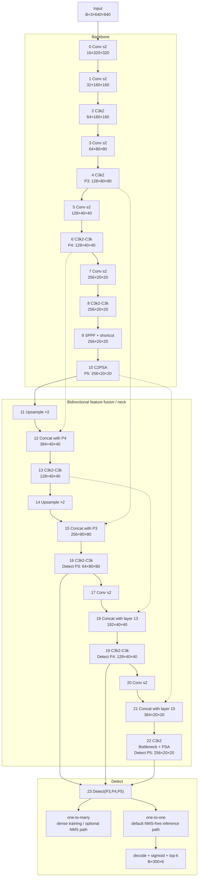

这个图揭示了三个修改边界：backbone 的 P3/P4/P5 是 neck 的外部接口；neck 同时有 top-down 和 bottom-up 消费者；Detect 的输入数量决定 stride、候选数、assigner 和导出输出。

## 3. 逐层 shape ledger

以下是 `scale=n`、输入 `B×3×640×640` 的本地 hook 结果（E001）。

| Layer | From | Module | Output | Stride | 内部单元 |
|---:|---:|---|---|---:|---|
| 0 | -1 | Conv 3×3/s2 | `B×16×320×320` | 2 | Conv-BN-SiLU |
| 1 | -1 | Conv 3×3/s2 | `B×32×160×160` | 4 | Conv-BN-SiLU |
| 2 | -1 | C3k2 | `B×64×160×160` | 4 | Bottleneck |
| 3 | -1 | Conv 3×3/s2 | `B×64×80×80` | 8 | Conv-BN-SiLU |
| 4 | -1 | C3k2 | `B×128×80×80` | 8 | Bottleneck |
| 5 | -1 | Conv 3×3/s2 | `B×128×40×40` | 16 | Conv-BN-SiLU |
| 6 | -1 | C3k2 | `B×128×40×40` | 16 | C3k |
| 7 | -1 | Conv 3×3/s2 | `B×256×20×20` | 32 | Conv-BN-SiLU |
| 8 | -1 | C3k2 | `B×256×20×20` | 32 | C3k |
| 9 | -1 | SPPF | `B×256×20×20` | 32 | 3× MaxPool + outer shortcut |
| 10 | -1 | C2PSA | `B×256×20×20` | 32 | one PSABlock for n scale |
| 11 | -1 | Upsample | `B×256×40×40` | 16 | nearest |
| 12 | 11,6 | Concat | `B×384×40×40` | 16 | channel concat |
| 13 | -1 | C3k2 | `B×128×40×40` | 16 | C3k |
| 14 | -1 | Upsample | `B×128×80×80` | 8 | nearest |
| 15 | 14,4 | Concat | `B×256×80×80` | 8 | channel concat |
| 16 | -1 | C3k2 | `B×64×80×80` | 8 | C3k |
| 17 | -1 | Conv 3×3/s2 | `B×64×40×40` | 16 | bottom-up downsample |
| 18 | 17,13 | Concat | `B×192×40×40` | 16 | channel concat |
| 19 | -1 | C3k2 | `B×128×40×40` | 16 | C3k |
| 20 | -1 | Conv 3×3/s2 | `B×128×20×20` | 32 | bottom-up downsample |
| 21 | 20,10 | Concat | `B×384×20×20` | 32 | channel concat |
| 22 | -1 | C3k2 | `B×256×20×20` | 32 | Bottleneck → PSABlock |
| 23 | 16,19,22 | Detect | raw: `B×(4+nc)×8400` per branch | 8/16/32 | two independent heads |

`8400 = 80² + 40² + 20²` 只表示候选位置数，不表示正样本数或最终框数。

## 4. YAML 如何变成 scale=n/s/m/l/x

```text
[from, repeats, module, args]
```

`parse_model()` 会做四类改写：解析来源节点；用 depth multiplier 缩放内部 repeats；用 width multiplier 与 `max_channels` 缩放通道并对齐到 8；把顶层 `reg_max`、`end2end` 和 Detect 输入通道追加到 head 构造参数。

| Scale | depth | width | max channels | 容易漏掉的变化 |
|---|---:|---:|---:|---|
| n | 0.50 | 0.25 | 1024 | 本页 shape 锚点，重复 2 通常缩为 1 |
| s | 0.50 | 0.50 | 1024 | repeats 同 n，通道更宽 |
| m | 0.50 | 1.00 | 512 | parser 会把 C3k2 的 `c3k` 强制为 true |
| l | 1.00 | 1.00 | 512 | repeats 增加 |
| x | 1.00 | 1.50 | 512 | 通道继续增加，但受 max channel 限制 |

所以 scale 不是纯宽度缩放；m/l/x 的 block 选择也可能变化。

## 5. 基础单元：Conv 与 Bottleneck

默认 `Conv(c1,c2,k,s)` 是 `Conv2d(bias=False) → BatchNorm2d → SiLU`。`model.fuse()` 会把 Conv 与 BN 合并，并把 forward 切到无 BN 路径。

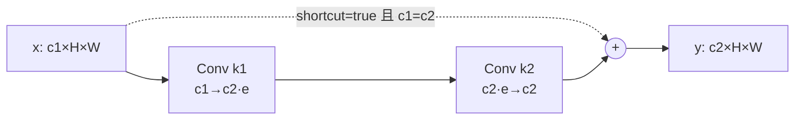

`Bottleneck` 是否残差相加由 `shortcut and c1 == c2` 决定。换 block 时只保持输出 shape 不够：hidden expansion、kernel、groups、shortcut 条件和 state_dict key 都会改变。

## 6. C2f、C3f、C3k 与 C3k2

### 6.1 C2f 是 C3k2 的外壳

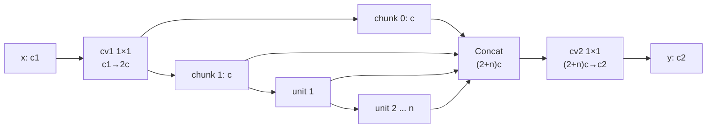

`c = int(c2 × e)`。每个 unit 只消费前一个 unit 的输出，但最终 concat 保留两个初始 chunk 与所有中间输出；这就是 feature reuse 与较短梯度路径的来源。

### 6.2 C3k2 只替换 unit，不改 C2f 外壳

| `attn` | `c3k` | `self.m[i]` | 默认 YOLO26 使用位置 |
|---|---|---|---|
| false | false | `Bottleneck(c,c)` | layer 2、4（n/s） |
| false | true | `C3k(c,c,n=2)` | layer 6、8、13、16、19 |
| true | 任意 | `Bottleneck(c,c) → PSABlock(c)` | layer 22；attention 分支优先于 c3k |

这解释了为什么 YAML 中全部写 `C3k2`，实际内部却有三种计算图。

### 6.3 C3k 内部

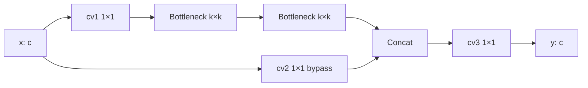

YOLO26 中 C3k2 创建 C3k 时固定内部 `n=2`，默认 `k=3`。C3k 继承 C3，但把 C3 的标准 `(1×1,3×3)` Bottleneck 改成 `(k×k,k×k)`。

### 6.4 C3f 为什么不是 C3k2

`C3f` 对输入做两个独立 1×1 projection：`cv2(x)` 直接保留，`cv1(x)` 进入连续 Bottleneck；最后 concat 两个起始分支和每个 Bottleneck 输出，再由 `cv3` 投影。C3k2 则只用一个 `cv1` 产生 `2c` 后 chunk，并通过可选 unit 改变内部计算。两者 shape 可以相同，但参数键、分支投影和内部 unit 不同，不能因名称相近直接互换权重。

## 7. SPPF：串行 pooling 与外层残差

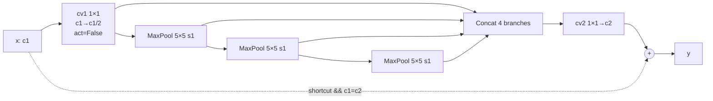

三次串行 5×5 pooling 近似获得 5、9、13 的上下文范围。YOLO26 默认 `[1024,5,3,true]` 开启最外层 shortcut，这与旧版只讲“SPPF concat”不同。它扩大深层上下文，但不会恢复此前下采样丢掉的像素信息。

## 8. C2PSA、PSABlock 与 Attention

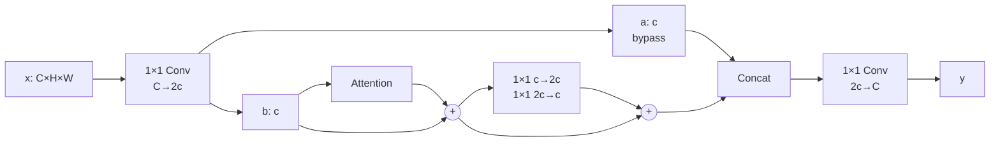

Attention 的内部张量是：

```text
x: B×C×H×W, N=H×W
q,k: B×heads×key_dim×N
v:   B×heads×head_dim×N
attention matrix: B×heads×N×N
output = projection(v @ softmax(qᵀk)) + depthwise positional encoding
```

`head_dim=C/heads`，`key_dim=int(head_dim×0.5)`。YOLO26n 的 layer 10 在 20×20、hidden 128、2 heads 上运行一个 PSABlock；layer 22 的 C3k2 也在 20×20 上运行 Bottleneck+PSABlock。

这里有一个重要修改经验：把同样 attention 从 P5 的 20×20 移到 P3 的 80×80，会让 N 从 400 变成 6400，`N²` attention matrix 元素数放大 256 倍。参数量变化可能不大，显存与延迟却可能失控；必须实测而不能只看 FLOPs 摘要。

## 9. Neck：为什么 concat 是结构修改的高风险边界

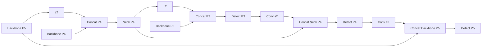

修改 backbone 输出通道时，至少同步检查四项：对应 concat 的通道和空间尺寸；后续 C3k2 的 `c1` 自动推导是否符合预期；Detect 输入通道；预训练权重的匹配报告。模型能建图只证明 shape 合法，不证明旧权重加载到了预期位置。

## 10. Detect：独立双 head 与梯度边界

每个尺度的 box/classification 路径为：

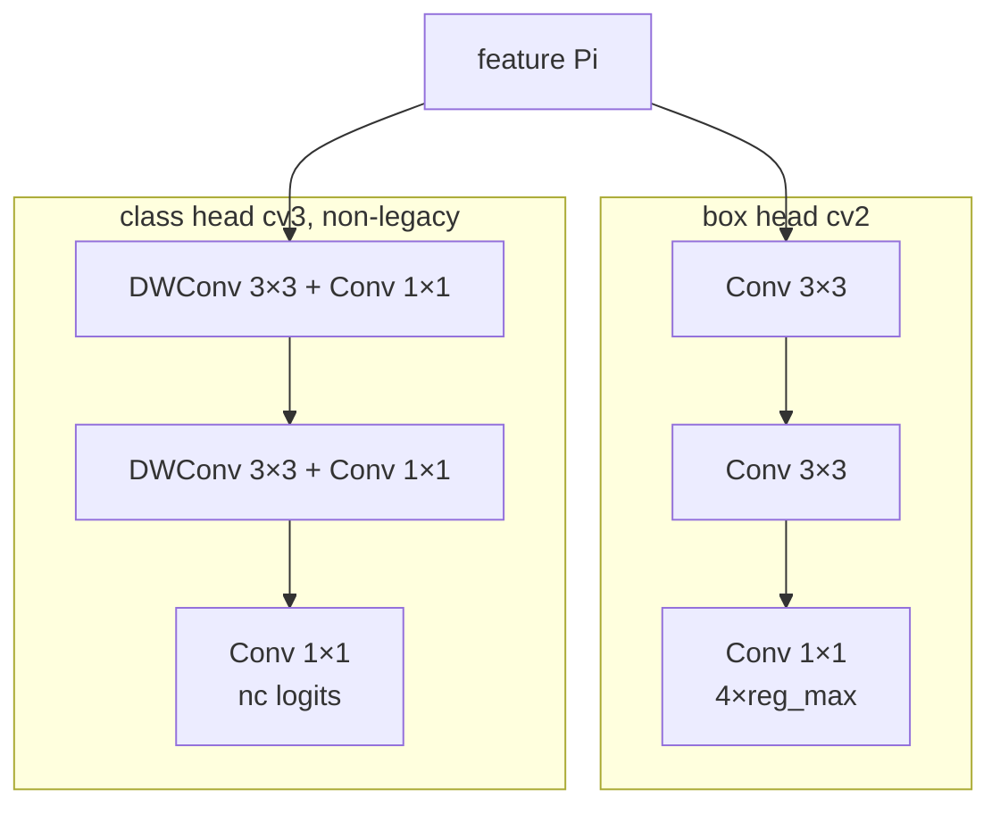

当 YAML 设置 `end2end: true`，构造函数 deep-copy `cv2/cv3`，产生参数独立的 one-to-one head：

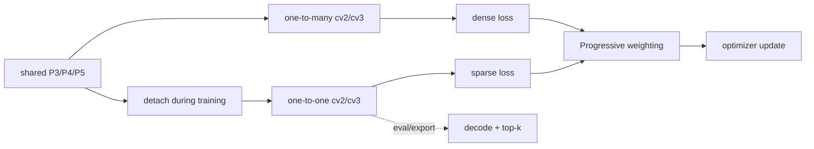

本地梯度 probe 观察到：只对 one-to-one raw 输出反向时，one-to-one head 有梯度而 backbone layer 0 为 0；只对 one-to-many raw 输出反向时，one-to-many head 与 backbone 都有梯度（E001）。这验证的是 `detach` 路径，不等价于真实数据训练质量。

## 11. `reg_max=1`：变量还叫 dfl，计算已经不是 DFL

默认 YOLO26：

```text
box head → 4 scalars per location → l,t,r,b distance → dist2bbox
```

YOLO11 常见路径：

```text
box head → 4×16 logits → per-side softmax expectation → l,t,r,b → dist2bbox
```

`reg_max=1` 时 `Detect.dfl` 是 `Identity`，box loss 仍包含 CIoU，同时把原来 loss 数组中的第三槽改为归一化 l/t/r/b 的加权 L1。名称仍沿用 `dfl`，但语义已经改变。本地把 YAML 临时改为 `reg_max=16` 后，128 输入的 raw box channel 从 4 变为 64，decoder 从 `Identity` 变为 `DFL`（E001）。

技术报告的受控实验指出：在其 YOLO26s/COCO 配置中，去掉 DFL 在 640 下 AP 从 46.0 到 46.3，在 1280 下从 49.8 到 51.1，主要增益出现在 large-object AP；这是作者报告，不是任意私有任务的结论（Y023）。

## 12. Assigners、STAL 与 Progressive Loss

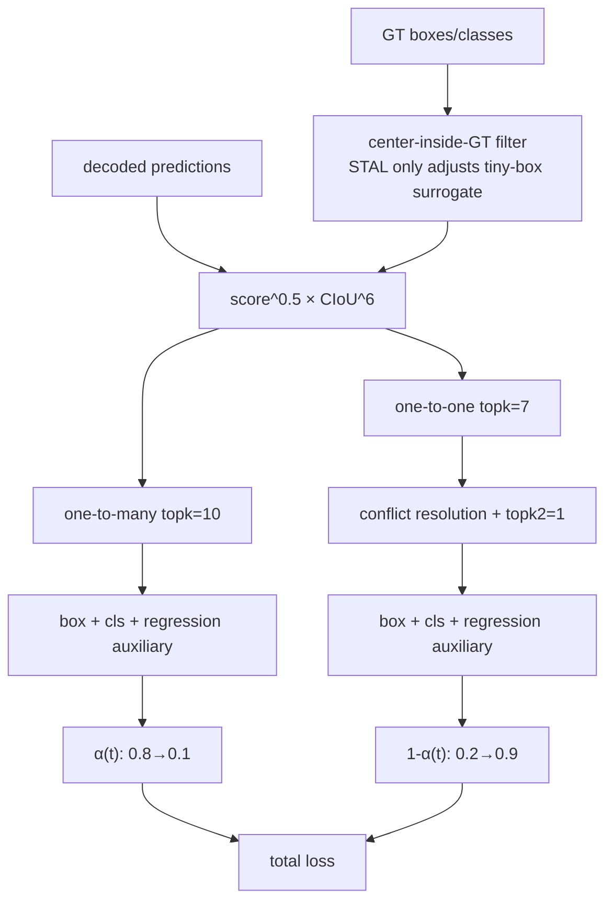

STAL 只为 candidate filtering 构造 surrogate box：默认 strides `[8,16,32]` 时，小于 8 像素的宽或高在筛候选时临时扩到 16；原始 GT 仍用于后续 matching 和 regression。它解决“tiny box 内没有 anchor center”的零正样本故障，不等于增加 P2，也不保证 tiny object 已有足够图像信息。

Progressive Loss 每个 epoch 更新一次权重。当前 trainer 对 resume 还会按起始 epoch 恢复 criterion update 状态；自定义 trainer 若漏掉 `criterion.update()` 或恢复点，会改变真实训练配方。

## 13. 推理、top-k 与 `end2end=False`

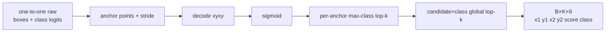

默认 `K≤300`，没有 IoU-based suppression，但仍有 decode、sigmoid 和两级 top-k，所以 NMS-free 不等于零后处理。`v8.4.120` 允许 predict/val/export 显式设置 `end2end=False`，改用 one-to-many raw output 和 NMS。640、80 类时常见合同是：

| 路径 | 输出 | 后处理 |
|---|---|---|
| `end2end=True` | `(B,300,6)` | 图内 decode + top-k，无 IoU NMS |
| `end2end=False` | `(B,84,8400)` | 图外 confidence/class filtering + NMS |

选择 head 是部署与任务 operating point，不是单向“新版一定更好”。第一方文档也明确 one-to-many 通常略高精度、但有 NMS 成本（Y023）。

## 14. train、eval、fuse、export 是四张图

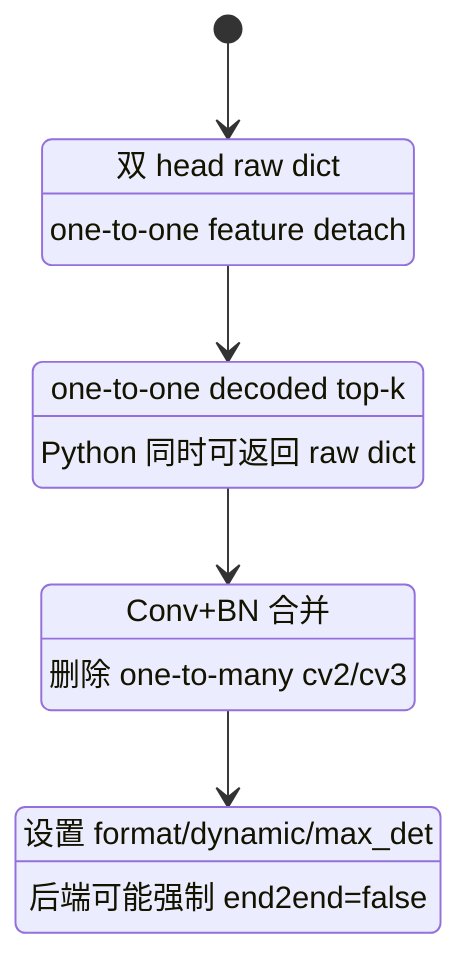

本地 smoke test 中，随机初始化 YOLO26n 从 2,572,280 参数降到 2,408,932，one-to-many head 被移除、one-to-one 保留；同一输入 fuse 前后最大绝对输出差为 0（E001）。这个数只验证固定环境下的结构与数值 smoke test，不是训练权重精度结论。

当前 exporter 会对 RKNN、NCNN、ExecuTorch、Paddle、IMX、EdgeTPU、QNN 强制关闭 end-to-end，因为这些路径不支持所需 top-k；LiteRT INT8、旧 TensorRT 和部分 JetPack/TensorRT INT8 组合也有显式降级。导出后必须以真实 output shape 和 metadata 判断走了哪条 head，不能只看模型名。

## 15. P2、默认、P6

| 配置 | Strides | 640 候选数 | 权重状态 | 主要假设 | 新成本 |
|---|---|---:|---|---|---|
| `yolo26-p2.yaml` | 4/8/16/32 | 34,000 | YAML-only，无 scale-specific 官方权重 | 更密候选帮助小目标 | 显存、延迟、背景候选与误检 |
| `yolo26.yaml` | 8/16/32 | 8,400 | 有正式权重 | 默认平衡 | 可能遗漏极小目标候选 |
| `yolo26-p6.yaml` | 8/16/32/64 | 8,500 | YAML-only，无 scale-specific 官方权重 | 大输入/大目标需要更深尺度 | 更深 backbone/neck 与新训练成本 |

三种配置的 stride、raw shape 和最终 `(1,300,6)` 已由本地合成输入运行核对（E001）。P2/P6 不是在预训练模型末尾多接一层即可；官方没有对应 scale 权重，必须训练或微调并重新建立基线。

## 16. 第一方消融告诉我们什么

技术报告从 YOLO11s 到 YOLO26s 的增量表显示（COCO、作者口径）：

| 增量 | E2E AP | Non-E2E AP | 能支持的判断 |
|---|---:|---:|---|
| YOLO11s baseline | — | 47.0 | 起点 |
| remove DFL | — | 46.4 | 单独删 DFL 有精度代价 |
| add L1 | — | 46.6 | 直接回归监督回收部分差距 |
| add STAL | — | 46.8 | 该配置下继续回收 |
| backbone/neck refinement | — | 47.0 | 末端 attention 等改动回到 baseline |
| enable E2E | 46.4 | 47.0 | one-to-one 与 one-to-many 有差距 |
| Progressive Loss | 46.7 | 47.2 | 两条 head 都变化 |
| MuSGD | 47.1 | 47.6 | optimizer 是最终结果的一部分 |
| Objects365 pretraining | 47.4 | 48.0 | 预训练数据贡献不可归因给结构 |
| hyperparameter search | 47.8 | 48.6 | 最终数字不是“只换架构”的结果 |

最重要的实践结论是：不能把 YOLO26 最终提升全部归因给某个 block。结构、L1、STAL、双 head、loss 调度、optimizer、Objects365 预训练和超参共同构成报告结果；自己的改造必须做受控消融。

## 17. 公开实践证据与可迁移教训

下面是 Ultralytics 官方仓库中的公开 issue/maintainer 回应。它们是现场信号，不是跨环境定律（Y029）。

| 公开实践 | 当前可支持 | 不应过度外推 | 可迁移动作 |
|---|---|---|---|
| ONNX end-to-end 输出疑问 #24697 | `(1,300,6)` 与 `(1,84,8400)` 可快速区分两条 head；混装 package/import path 会制造假差异 | Python 版本本身决定 end2end | 同时记录 `ultralytics.__version__`、`ultralytics.__file__`、输出 shape 和 metadata |
| `classes + max_det` 丢框 #25044 | 旧版本在 top-k 后过滤类别会静默丢框；当前 predictor 保持 head top-k≥300 再过滤 | 所有 release 都仍有此 bug | 迁移时为类别过滤、max_det 组合建立回归测试 |
| TensorRT partial batch #25753 | 静态 export 不能接收不同 batch；`dynamic=True` 时 batch 才是最大值 | layer 2 Split 是 YOLO26 特有缺陷 | 固定/动态 profile、实际 runtime batch 与 padding 必须一起记录 |
| TensorRT INT8 score compression #24668 | 一个公开案例中排名和 peak F1 尚可，但绝对 score 被压缩；旧 calibration cache 会干扰复测 | NMS-free 天生造成 score compression | 删除旧 cache、重建 calibration、画各模型自己的 PR/F1-score 曲线，不复用阈值 |
| RKNN INT8 #24613 | 官方从 `8.4.59` 起加入 calibration-backed INT8；当前 exporter 仍会关闭 end-to-end top-k path | “支持 RKNN INT8”等于保留默认 E2E 图 | 核对版本、raw output、CPU NMS、校准集和目标 SoC |
| subtle texture/defect #23794 | 社区案例提示 one-to-one 与 one-to-many 可能在细微目标上不同 | YOLO11 一定更懂纹理或 YOLO26 只看边缘 | 同一权重/数据分别 val `end2end=true/false`，再检查标签和目标像素 |

## 18. 本地可复现实践

完整命令、环境、失败尝试和结果见 [YOLO26 architecture smoke tests](../../../../engineering/cases/yolo26-architecture-smoke-tests.md)；脚本见 [`yolo26_architecture_smoke_test.py`](../../../../engineering/cases/yolo26_architecture_smoke_test.py)（E001）。当前已覆盖：

- 默认、P2、P6 的逐层/输出 shape；
- C3k2 在各层选择的真实内部 unit；
- one-to-one detach 的梯度边界；
- `reg_max=1→16` 的 raw channel 和 decoder 改变；
- fuse 前后参数、head 移除和输出一致性；
- ONNX 图包含 TopK、不包含 NonMaxSuppression，输出 `(1,300,6)`。

尚未覆盖真实权重、数据训练、AP、延迟、量化和目标硬件，因此不能把这些 smoke tests 当成模型效果验证。

## 19. 修改结构时的最小闭环

### 增加 P2

1. 先统计网络输入上的目标宽高，而不是从“目标很小”直接跳到 P2；
2. 以官方 P2 YAML 为结构参考，核对 top-down、bottom-up、Detect 四个输入与 strides；
3. 运行 shape、forward/backward、候选数和显存检查；
4. 从头训练或明确权重加载缺失项；
5. 按目标尺寸比较 AP/recall、误检、延迟，而不是只看总 mAP。

### 替换 C3k2 内部 block

1. 明确替换外壳还是 `self.m` unit；
2. 固定 `c1/c2/e/n/shortcut/g` 合同；
3. 检查 parser 是否需要注册新 module 和 repeat 规则；
4. 输出 state_dict missing/unexpected keys；
5. 单独验证 export operator、显存和延迟；
6. 采用同数据、同训练预算的受控消融。

### 移动或增加 attention

1. 计算目标层 `N=H×W`，先估算 `N²` attention matrix；
2. 核对 hidden channel、head 数和整除条件；
3. 分别测参数、峰值显存、训练吞吐和目标 runtime；
4. 保留无 attention 与原 P5 attention 两个基线。

### 修改 `reg_max`

1. 同步 box head 输出 `4×reg_max`、DFL decoder 和 BboxLoss；
2. 不加载不兼容的 box-head 权重并假装完全继承；
3. 检查 raw/decode/export shape；
4. 按目标尺寸分析定位误差，尤其是大目标和高分辨率；
5. 比较导出算子、量化误差与真实延迟。

### 修改 one-to-one/head postprocess

1. 同时检查 deep-copy、training detach、assigner、Progressive Loss、fuse 和 exporter；
2. 构造重复框、密集目标、类别过滤与小 `max_det` 的单测；
3. 分别验证 E2E 与 non-E2E 输出，不复用同一阈值假设；
4. 目标后端若不支持 top-k，明确选择 raw output + NMS，而不是静默降级。

## 20. 面试推导检查

- 为什么 YOLO26 的 NMS-free 不是“删除 NMS”这么简单？——需要 one-to-one 参数、稀疏 assignment、渐进 loss 和 top-k 输出合同共同成立。
- 为什么 one-to-one feature 要 detach？——让稀疏 head 学参数，但 shared feature 主要由 dense supervision 训练；代价是辅助 head 不能随便删。
- 为什么 `reg_max=1` 不应回答成“单 bin DFL”？——控制流进入 Identity + L1 direct regression，而不是 softmax expectation。
- 为什么 P2 与 STAL 不是一回事？——P2 增加高分辨率候选；STAL 只修改 tiny GT 的候选筛选几何。
- 为什么 attention 放在 P5？——全局交互成本随 `N²` 增长，低分辨率位置更可控。
- 为什么最终 AP 不能归因给 C3k2？——报告本身同时改变 loss、assigner、optimizer、预训练和超参。
- 为什么导出后先看 shape？——`(B,300,6)` 与 `(B,4+nc,N)` 直接暴露 head 与后处理合同。

## 21. 当前证据边界与下一道门

- 总体结构、模块控制流和输出合同有固定源码指针；shape、梯度、fuse 与 ONNX 有本地 smoke test；
- 第一方消融仍是模型发布方报告，尚无本仓库独立训练复现；
- GitHub issue 只作为实践信号，必须保留版本、环境、是否已修复和复现状态；
- 真实结构改造、训练、量化、延迟与目标硬件结果尚未执行；
- 本页继续保持 `working / partial / owner_review: pending`。

晋级到 `validated` 至少需要：本人审查图与术语；固定真实权重和数据；完成一个受控结构改造；保存训练/评测/导出原始证据；用独立任务 Oracle 判断接受或回滚。
